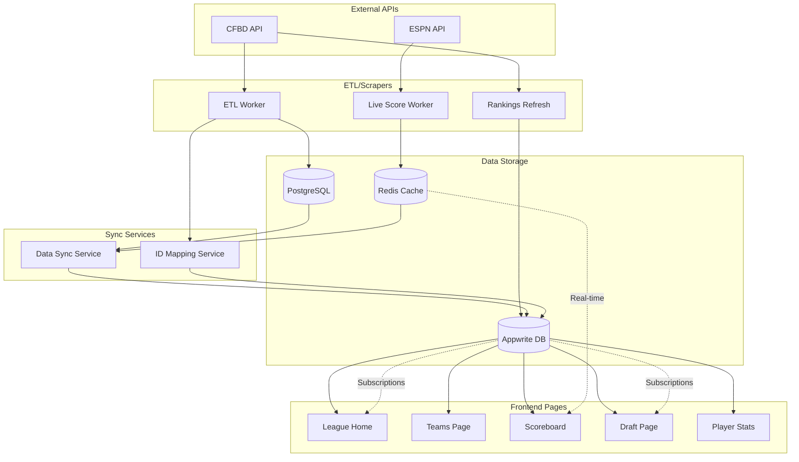

# Data Flow Diagram - APIs to Frontend Pages

## 🔄 Complete Data Flow Architecture



## 📊 Data Collections to Frontend Mapping

### 🏠 **League Home Page**
```
Required Data:
├── leagues (Appwrite)
│   └── League settings, scoring rules
├── teams (Appwrite)
│   └── Team names, owners, records
├── rankings (Appwrite)
│   └── AP Top-25 display
└── transactions (Appwrite)
    └── Recent activity feed

API Sources:
├── CFBD → Rankings → Appwrite
└── User Actions → Transactions → Appwrite
```

### 👥 **Teams Page**
```
Required Data:
├── teams (Appwrite)
│   └── Team information
├── rosters (Appwrite)
│   └── Current player lineup
├── players (Appwrite)
│   └── Player details
└── player_stats (Appwrite)
    └── Performance metrics

API Sources:
├── CFBD → Players → ETL → Appwrite
└── ESPN → Live Stats → Redis → Sync → Appwrite
```

### 📊 **Scoreboard Page**
```
Required Data:
├── games (Appwrite)
│   └── Game schedules and scores
├── player_stats (Appwrite)
│   └── Real-time performance
├── rosters (Appwrite)
│   └── Active lineups
└── teams (Appwrite)
    └── Fantasy points totals

API Sources:
├── ESPN → Live Scores → Redis
├── Redis → Sync Service → Appwrite
└── Scoring Engine → Fantasy Points → Appwrite
```

### 🎯 **Draft Page**
```
Required Data:
├── players (Appwrite)
│   └── Available players
├── draft_picks (Appwrite)
│   └── Pick history
├── teams (Appwrite)
│   └── Draft order
└── leagues (Appwrite)
    └── Draft settings

API Sources:
├── CFBD → Players → ETL → Appwrite
└── User Actions → Draft Picks → Appwrite
```

### 📈 **Player Stats Page**
```
Required Data:
├── players (Appwrite)
│   └── Player information
├── player_stats (Appwrite)
│   └── Historical stats
├── games (Appwrite)
│   └── Game context
└── rankings (Appwrite)
    └── Team rankings

API Sources:
├── CFBD → Stats → ETL → Appwrite
└── ESPN → Box Scores → Live Worker → Appwrite
```

## 🔗 Critical Data Links

### 1. **ID Mapping Flow**
```
External ID (CFBD/ESPN) → ID Mapping Service → Internal UUID (Appwrite)
```

### 2. **Live Score Flow**
```
ESPN API → Live Worker → Redis Pub/Sub → Sync Service → Appwrite Realtime → Frontend
```

### 3. **Draft Flow**
```
User Selection → Draft Pick → Roster Update → Team Score Calculation
```

### 4. **Transaction Flow**
```
User Action → Transaction Log → Roster Update → Score Recalculation
```

## 🚨 Data Verification Points

### **Before Deployment:**
1. ✅ All Appwrite collections created
2. ✅ ID mappings populated
3. ✅ Sample data in each collection
4. ✅ API endpoints tested
5. ✅ Real-time subscriptions working

### **During Operation:**
1. 📊 Monitor sync latency (< 5 seconds)
2. 📊 Check ID mapping success rate (> 99%)
3. 📊 Verify data completeness
4. 📊 Track API response times
5. 📊 Monitor error rates

## 🛠️ Testing Commands

```bash
# 1. Verify all data links
npx ts-node src/scripts/verify-data-links.ts

# 2. Test specific page data
curl https://your-app.vercel.app/api/teams
curl https://your-app.vercel.app/api/rankings
curl https://your-app.vercel.app/api/games

# 3. Check Appwrite collections
# Use Appwrite Console or SDK to verify data

# 4. Test real-time updates
# Open browser console and check WebSocket connections
```

## 📱 Frontend Integration Checklist

### **League Home**
- [ ] Fetch leagues from Appwrite
- [ ] Display rankings from rankings collection
- [ ] Show recent transactions
- [ ] Real-time league updates

### **Teams Page**
- [ ] Load team rosters
- [ ] Display player stats
- [ ] Calculate fantasy points
- [ ] Show team standings

### **Scoreboard**
- [ ] Real-time game scores
- [ ] Live fantasy point updates
- [ ] Player performance tracking
- [ ] Score animations

### **Draft Page**
- [ ] Available players list
- [ ] Draft timer sync
- [ ] Pick notifications
- [ ] Auto-draft functionality

### **Player Stats**
- [ ] Historical performance
- [ ] Season statistics
- [ ] Matchup analysis
- [ ] Trend charts

## 🎯 Success Criteria

1. **Data Freshness**
   - Rankings: Updated weekly
   - Live scores: < 30 second delay
   - Player stats: Real-time during games

2. **Data Accuracy**
   - ID mappings: 100% accurate
   - Fantasy points: Matches scoring rules
   - Transactions: Atomic and consistent

3. **Performance**
   - Page load: < 3 seconds
   - API response: < 100ms
   - Real-time updates: < 5 seconds

This diagram ensures all data flows correctly from external APIs through your backend services to the frontend pages where users interact with the data.