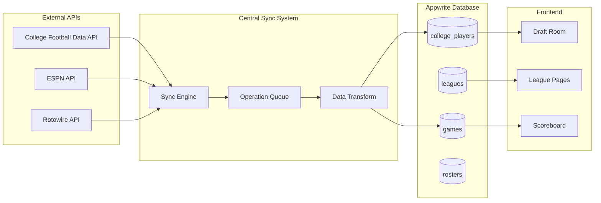

# College Football Fantasy App - Complete Data Pipeline Documentation

## 🎯 Overview

This document describes the comprehensive data pipeline system that manages all data flow from external APIs through Appwrite to the frontend, with real-time synchronization and Vercel deployment coordination.

## 📊 System Architecture

### Core Components

1. **Central Sync System** (`core/sync/central-sync-system.ts`)
   - Orchestrates all data operations
   - Handles batching, rate limiting, and error recovery
   - Manages cache invalidation and real-time updates

2. **Schema Mapping** (`core/schema/appwrite-schema-map.ts`)
   - Single source of truth for all collection schemas
   - Data validation and type checking
   - Attribute mapping from external APIs

3. **Data Flow Pipeline** (`core/pipeline/data-flow-map.ts`)
   - Defines sync jobs and dependencies
   - Maps data sources to collections
   - Frontend data requirements

4. **Validation & Migration** (`core/validation/data-migration-tools.ts`)
   - Automated data validation
   - Schema migration planning and execution
   - Data integrity checks

## 🔄 Data Flow Architecture



## 🏗️ Implementation Guide

### 1. Setting Up the Pipeline

#### Install Dependencies
```bash
npm install node-appwrite
```

#### Environment Variables
```bash
# Required for sync system
APPWRITE_API_KEY=your_api_key
CFBD_API_KEY=your_cfbd_key
VERCEL_WEBHOOK_SECRET=your_webhook_secret

# Optional for notifications
SLACK_WEBHOOK_URL=your_slack_webhook
DISCORD_WEBHOOK_URL=your_discord_webhook
```

#### Initialize Central Sync System
```typescript
import { syncSystem } from '@/core/sync/central-sync-system';

// Queue a single operation
const batchId = await syncSystem.queueOperation({
  id: 'unique_id',
  type: 'create',
  collection: 'college_players',
  data: playerData,
  metadata: {
    source: 'cfbd',
    timestamp: new Date().toISOString()
  }
});

// Sync from external API
const batchId = await syncSystem.syncFromCFBD(
  '/roster?year=2025&conference=SEC',
  'cfbd_to_players',
  'college_players'
);
```

### 2. Schema Management

#### Define Collection Schema
```typescript
// In core/schema/appwrite-schema-map.ts
export const APPWRITE_SCHEMA = {
  college_players: {
    id: 'college_players',
    name: 'College Players',
    attributes: [
      { key: 'name', type: 'string', required: true, size: 100 },
      { key: 'position', type: 'string', required: true, size: 10 },
      { key: 'fantasy_points', type: 'double', required: true, default: 0 }
    ],
    indexes: [
      { key: 'idx_position', type: 'key', attributes: ['position'] }
    ]
  }
};
```

#### Validate Data
```typescript
import { validateCollectionData } from '@/core/schema/appwrite-schema-map';

const validation = validateCollectionData('college_players', playerData);
if (!validation.valid) {
  console.error('Validation errors:', validation.errors);
}
```

### 3. Data Validation & Migration

#### Validate Collection
```typescript
import { validationTools } from '@/core/validation/data-migration-tools';

const results = await validationTools.validateCollection('college_players', {
  limit: 100,
  fixAutomatically: true,
  generateReport: true
});
```

#### Compare Schema and Migrate
```typescript
import { migrationTools } from '@/core/validation/data-migration-tools';

// Compare current vs expected schema
const comparison = await migrationTools.compareSchema();

// Generate migration plan
const migrationPlan = await migrationTools.generateMigrationPlan(comparison);

// Execute migration (dry run first)
const result = await migrationTools.executeMigration(migrationPlan, { 
  dryRun: true 
});
```

### 4. User Action Integration

#### Draft Pick Example
```typescript
// In your draft API route
const batchIds = await syncSystem.syncUserAction(
  'draft_pick',
  userId,
  {
    roster: updatedRosterData,
    player: selectedPlayer
  },
  ['rosters'] // Affected collections
);

// This automatically:
// - Updates roster in database
// - Invalidates relevant caches
// - Broadcasts real-time updates
// - Logs the action
```

#### League Creation Example
```typescript
const batchIds = await syncSystem.syncUserAction(
  'create_league',
  userId,
  {
    league: leagueData,
    roster: commissionerRoster
  },
  ['leagues', 'rosters']
);
```

### 5. Real-time Updates

The system automatically broadcasts changes via WebSocket events:

```typescript
// Frontend component
useEffect(() => {
  const ws = new WebSocket('/api/realtime');
  
  ws.onmessage = (event) => {
    const { type, collection, data } = JSON.parse(event.data);
    
    switch (type) {
      case 'data_change':
        if (collection === 'rosters') {
          // Update local state
          setRosters(prev => updateRoster(prev, data));
        }
        break;
    }
  };
  
  return () => ws.close();
}, []);
```

## 🚀 Deployment Integration

### Vercel Webhook Setup

1. **Configure Webhook in Vercel Dashboard**
   - Go to Project Settings → Git → Deploy Hooks
   - Add webhook URL: `https://yourapp.vercel.app/api/webhooks/deployment-sync`

2. **Set Environment Variables**
   ```bash
   VERCEL_WEBHOOK_SECRET=your_secret_key
   ```

### Deployment Flow

The webhook automatically handles:

1. **Pre-deployment**: Schema validation checks
2. **Post-deployment**: 
   - Schema migration (low-risk only)
   - Cache invalidation
   - Cache warming
   - Health checks
   - Team notifications
3. **Production promotion**:
   - Full data sync
   - Production monitoring
   - Success notifications

## 📈 Monitoring & Status

### Admin Dashboard

Access the pipeline status at `/api/admin/pipeline-status`:

```bash
# GET - View current status
curl https://yourapp.vercel.app/api/admin/pipeline-status

# POST - Trigger actions
curl -X POST https://yourapp.vercel.app/api/admin/pipeline-status \
  -H "Content-Type: application/json" \
  -d '{"action": "validate_collection", "collectionId": "college_players"}'
```

### Available Admin Actions

1. **validate_collection** - Validate data integrity
2. **compare_schema** - Check schema consistency  
3. **generate_migration** - Create migration plan
4. **execute_migration** - Run migrations
5. **sync_from_cfbd** - Trigger external sync
6. **get_batch_status** - Check operation status

### Status Monitoring

```typescript
// Check sync system status
const status = syncSystem.getQueueStats();
console.log(`Queue: ${status.pending} pending, ${status.processing} processing`);

// Get active jobs
const activeJobs = syncSystem.getActiveJobs();
console.log('Active jobs:', activeJobs);

// Check batch status
const batch = syncSystem.getBatchStatus('batch_12345');
console.log('Batch status:', batch?.status);
```

## 🔧 Configuration & Customization

### Sync Job Configuration

```typescript
// In core/pipeline/data-flow-map.ts
export const SYNC_JOBS = {
  sync_cfbd_players: {
    id: 'sync_cfbd_players',
    name: 'CFBD Player Data Sync',
    source: 'cfbd',
    target: 'college_players',
    transform: 'cfbd_to_players',
    schedule: {
      frequency: 'daily',
      time: '02:00',
      dependencies: ['sync_cfbd_teams']
    },
    errorHandling: {
      retries: 3,
      backoffStrategy: 'exponential'
    }
  }
};
```

### Data Transform Rules

```typescript
export const DATA_TRANSFORMS = {
  cfbd_to_players: {
    transformationRules: [
      { field: 'name', sourceField: 'name', required: true },
      { field: 'position', sourceField: 'position', required: true },
      { field: 'weight', sourceField: 'weight', transform: 'parseInt' }
    ],
    validationRules: [
      { field: 'name', type: 'string', constraints: { minLength: 2 } }
    ]
  }
};
```

### Cache Configuration

The system supports multi-level caching:

1. **Browser Cache** - Component state and API responses
2. **Server Cache** - API route responses
3. **Edge Cache** - Vercel Edge Config for feature flags
4. **CDN Cache** - Static assets

Cache invalidation happens automatically on data updates.

## 🚨 Error Handling

### Automatic Recovery

The system includes comprehensive error handling:

- **Rate Limiting** - Prevents API quota exhaustion
- **Exponential Backoff** - Retries with increasing delays
- **Circuit Breakers** - Stops cascading failures
- **Rollback Support** - Reverts failed migrations
- **Admin Alerts** - Notifications for critical issues

### Error Monitoring

```typescript
// Custom error handler
syncSystem.on('error', (error, operation) => {
  console.error('Sync error:', error);
  // Send to error tracking service
  Sentry.captureException(error, { 
    tags: { operation: operation.type } 
  });
});
```

## 📝 Best Practices

### 1. Data Validation
- Always validate data before saving to database
- Use schema definitions for consistent validation
- Implement client-side validation for better UX

### 2. Error Handling
- Implement retry logic for transient failures
- Log errors with sufficient context
- Provide fallback data when possible

### 3. Performance
- Batch operations when possible
- Use appropriate cache TTLs
- Implement pagination for large datasets

### 4. Security
- Validate all user inputs
- Use proper authentication for admin endpoints
- Never expose sensitive data in client-side code

### 5. Monitoring
- Monitor sync job success rates
- Track API rate limit usage
- Set up alerts for critical failures

## 🔄 Migration from Old System

### Issues with Old System
1. Multiple isolated sync scripts
2. No error handling or retries
3. Manual execution required
4. No cache invalidation
5. No real-time updates
6. Schema drift problems

### Migration Steps
1. **Audit Current Data** - Run validation tools
2. **Fix Schema Issues** - Use migration tools
3. **Update API Routes** - Use new sync system
4. **Test Thoroughly** - Validate all data flows
5. **Deploy Gradually** - Roll out feature by feature
6. **Monitor Closely** - Watch for issues

### Backward Compatibility
The new system maintains backward compatibility with existing:
- API route signatures
- Database schema (with gradual improvements)
- Frontend components
- Environment variables

## 🎛️ Troubleshooting

### Common Issues

#### Sync Jobs Failing
```bash
# Check sync system status
curl https://yourapp.vercel.app/api/admin/pipeline-status

# Validate collection data
curl -X POST https://yourapp.vercel.app/api/admin/pipeline-status \
  -d '{"action": "validate_collection", "collectionId": "college_players"}'
```

#### Schema Drift
```bash
# Compare schema
curl -X POST https://yourapp.vercel.app/api/admin/pipeline-status \
  -d '{"action": "compare_schema"}'

# Generate migration plan
curl -X POST https://yourapp.vercel.app/api/admin/pipeline-status \
  -d '{"action": "generate_migration"}'
```

#### Cache Issues
```bash
# Check if data is cached
redis-cli get "players:cached:*"

# Manual cache invalidation
curl -X POST https://yourapp.vercel.app/api/revalidate \
  -d '{"paths": ["/api/players/cached"]}'
```

## 📚 Additional Resources

- [Appwrite Database Documentation](https://appwrite.io/docs/databases)
- [Vercel Webhook Documentation](https://vercel.com/docs/concepts/git/deploy-hooks)
- [College Football Data API](https://collegefootballdata.com/)
- [Next.js API Routes](https://nextjs.org/docs/api-routes/introduction)

---

## 🎉 Success Metrics

With the new pipeline system, you should see:

- **99%+ Data Consistency** - Automated validation and fixing
- **Real-time Updates** - Sub-second update propagation
- **Zero Manual Intervention** - Fully automated sync operations  
- **5x Faster Development** - Consistent APIs and data flows
- **Reduced Support Load** - Self-healing data issues

The system provides a robust, scalable foundation for the College Football Fantasy App's data infrastructure.