# College Football Fantasy - Project Map

**Single Source of Truth**: `schema/zod-schema.ts`  
**Canonical Configs**: `lib/appwrite.ts` + `lib/appwrite-server.ts`  
**Status**: ✅ Fully Consolidated Architecture (August 2025)

---

## 📁 Repository Structure

```mermaid
graph TD
    ROOT[🏠 college-football-fantasy-app]
    
    %% Core Application
    ROOT --> APP[📱 app/<br/>Next.js 15 App Router<br/>Pages & API Routes]
    ROOT --> COMPONENTS[🧩 components/<br/>React Components<br/>UI Library]
    ROOT --> SCHEMA[📋 schema/<br/>🎯 SINGLE SOURCE OF TRUTH<br/>zod-schema.ts]
    
    %% Configuration & Services  
    ROOT --> LIB[⚙️ lib/<br/>Appwrite Clients<br/>Services & Utils]
    ROOT --> CORE[🔧 core/<br/>Config, Auth<br/>Domain Logic]
    ROOT --> HOOKS[🪝 hooks/<br/>React Hooks<br/>Realtime Logic]
    ROOT --> TYPES[📝 types/<br/>TypeScript Types<br/>Shared Interfaces]
    
    %% Data & Scripts
    ROOT --> SCRIPTS[📜 scripts/<br/>Migrations, Sync<br/>Validation Guards]
    ROOT --> DATA[💾 data/<br/>Static Data<br/>CSV/JSON Sources]
    ROOT --> FUNCTIONS[⚡ functions/<br/>Appwrite Functions<br/>Serverless Code]
    
    %% Documentation & Deployment
    ROOT --> DOCS[📚 docs/<br/>Documentation<br/>Project Memory]
    ROOT --> VENDOR[📦 vendor/<br/>Submodules<br/>3D Assets]
    
    %% Key Files Detail
    SCHEMA --> SSOT[🎯 zod-schema.ts<br/>Collections, Types<br/>Validation Rules]
    LIB --> FRONTEND[🌐 appwrite.ts<br/>Frontend Client<br/>Session Auth]
    LIB --> BACKEND[🔧 appwrite-server.ts<br/>Server Client<br/>API Key Auth]
    SCRIPTS --> GUARDS[🛡️ guards/<br/>Build Validation<br/>Schema Drift Prevention]
    
    %% Styling
    style SCHEMA fill:#fff2cc,stroke:#d6b656,stroke-width:4px,color:#000000
    style SSOT fill:#fff2cc,stroke:#d6b656,stroke-width:4px,color:#000000
    style GUARDS fill:#f8cecc,stroke:#b85450,stroke-width:3px,color:#000000
    style FRONTEND fill:#d5e8d4,stroke:#82b366,stroke-width:3px,color:#000000
    style BACKEND fill:#d5e8d4,stroke:#82b366,stroke-width:3px,color:#000000
```



---

## 🔄 Functionality & Data Flow

```mermaid
graph TB
    %% External Data Sources
    subgraph "🌐 External APIs"
        CFBD[🏈 College Football<br/>Data API<br/>Players, Games, Rankings]
        ESPN[📺 ESPN API<br/>Live Scores<br/>Game Updates]
    end
    
    %% Single Source of Truth
    subgraph "🎯 Schema SSOT"
        SSOT_SCHEMA[📋 schema/zod-schema.ts<br/>🔥 SINGLE SOURCE OF TRUTH<br/>Collections, Types, Validation]
        COLLECTIONS[📚 COLLECTIONS Registry<br/>user_teams, leagues<br/>college_players, games]
        TYPES[🔧 TypeScript Types<br/>Auto-generated<br/>from Zod schemas]
        VALIDATION[✅ Validation Functions<br/>validateData()<br/>Runtime checks]
    end
    
    %% Database Layer
    subgraph "🗄️ Appwrite Database (NYC)"
        subgraph "Core Collections"
            PLAYERS[(👥 college_players<br/>Name, Position, Team<br/>Fantasy Points)]
            TEAMS[(🏫 teams<br/>School, Conference<br/>Colors, Logos)]
            GAMES[(🎯 games<br/>Scores, Eligibility<br/>Week, Status)]
            RANKINGS[(🏆 rankings<br/>AP Top 25<br/>Weekly)]
        end
        
        subgraph "Fantasy Collections"  
            LEAGUES[(🏟️ leagues<br/>Commissioner<br/>Settings, Status)]
            USER_TEAMS[(👥 user_teams<br/>Team Rosters<br/>Wins, Points)]
            LINEUPS[(📋 lineups<br/>Starting Players<br/>Weekly Sets)]
        end
        
        subgraph "Draft System"
            MOCK_DRAFTS[(🎯 mock_drafts<br/>Live Human Draft<br/>2-24 Teams)]
            MOCK_PICKS[(✅ mock_draft_picks<br/>Draft Selections<br/>Snake Algorithm)]
            DRAFT_PICKS[(📋 draft_picks<br/>League Drafts<br/>Real-time)]
        end
    end
    
    %% Application Layer
    subgraph "⚡ Next.js API Routes"
        API_PLAYERS[👥 /api/draft/players<br/>Cached Player Lists<br/>Fantasy Projections]
        API_LEAGUES[🏟️ /api/leagues/*<br/>Create, Join, Manage<br/>Commissioner Tools]
        API_MOCK[🎯 /api/mock-draft/*<br/>Live Human Draft<br/>Turn Management]
        API_DRAFT[📋 /api/draft/*<br/>Real Draft System<br/>Pick Management]
    end
    
    %% Frontend Layer
    subgraph "💻 Frontend Pages"
        MOCK_DRAFT_UI[🎯 /mock-draft/[id]<br/>Live Draft Room<br/>Real-time Picks]
        DRAFT_UI[📋 /draft/[leagueId]<br/>League Draft<br/>Timer & Autopick]
        LEAGUE_UI[🏟️ /league/*<br/>Management Pages<br/>Commissioner Tools]
        RESULTS_UI[📊 Results & Export<br/>JSON/CSV Download<br/>Team Summaries]
    end
    
    %% Realtime System
    subgraph "🔌 Real-time Updates"
        REALTIME[⚡ Appwrite Realtime<br/>Live Subscriptions<br/>Event Broadcasting]
        WEBSOCKETS[🔗 WebSocket Channels<br/>Draft Picks, League Updates<br/>Turn Changes]
    end
    
    %% Data Flow Connections
    
    %% External → SSOT → Database
    CFBD -->|Daily Sync| SSOT_SCHEMA
    ESPN -->|Live Updates| SSOT_SCHEMA
    SSOT_SCHEMA --> COLLECTIONS
    SSOT_SCHEMA --> TYPES
    SSOT_SCHEMA --> VALIDATION
    
    %% SSOT → Database Schema
    COLLECTIONS --> PLAYERS
    COLLECTIONS --> TEAMS
    COLLECTIONS --> GAMES
    COLLECTIONS --> LEAGUES
    COLLECTIONS --> USER_TEAMS
    COLLECTIONS --> MOCK_DRAFTS
    
    %% Database → API Routes
    PLAYERS --> API_PLAYERS
    LEAGUES --> API_LEAGUES
    MOCK_DRAFTS --> API_MOCK
    DRAFT_PICKS --> API_DRAFT
    
    %% API → Frontend
    API_PLAYERS --> DRAFT_UI
    API_LEAGUES --> LEAGUE_UI
    API_MOCK --> MOCK_DRAFT_UI
    API_DRAFT --> RESULTS_UI
    
    %% Real-time Updates
    MOCK_PICKS -.->|Live Updates| REALTIME
    DRAFT_PICKS -.->|Live Updates| REALTIME
    USER_TEAMS -.->|Live Updates| REALTIME
    REALTIME --> WEBSOCKETS
    WEBSOCKETS -.-> MOCK_DRAFT_UI
    WEBSOCKETS -.-> DRAFT_UI
    WEBSOCKETS -.-> LEAGUE_UI
    
    %% Validation Guards
    VALIDATION -.->|Runtime Checks| API_PLAYERS
    VALIDATION -.->|Runtime Checks| API_LEAGUES
    VALIDATION -.->|Runtime Checks| API_MOCK
    
    %% Styling
    style SSOT_SCHEMA fill:#fff2cc,stroke:#d6b656,stroke-width:4px,color:#000000
    style COLLECTIONS fill:#fff2cc,stroke:#d6b656,stroke-width:3px,color:#000000
    style TYPES fill:#fff2cc,stroke:#d6b656,stroke-width:3px,color:#000000
    style VALIDATION fill:#f8cecc,stroke:#b85450,stroke-width:3px,color:#000000
    style REALTIME fill:#e1d5e7,stroke:#9673a6,stroke-width:3px,color:#000000
    style WEBSOCKETS fill:#e1d5e7,stroke:#9673a6,stroke-width:3px,color:#000000
```

---

## 🎯 Key Architecture Principles

### Single Source of Truth (SSOT)
- **Location**: `schema/zod-schema.ts`
- **Purpose**: Define ALL collections, types, validation
- **Benefits**: Zero schema drift, automatic TypeScript generation, runtime validation

### Centralized Configuration  
- **Frontend**: `lib/appwrite.ts` (session auth)
- **Backend**: `lib/appwrite-server.ts` (API key auth)
- **Result**: No configuration duplication, consistent imports

### Build-time Validation
- **Guards**: `scripts/guards/forbid-legacy-collections.ts`
- **Trigger**: `npm run prebuild` (automatic)
- **Purpose**: Prevent hardcoded collection names, enforce SSOT usage

### Real-time Architecture
- **Technology**: Appwrite Realtime + WebSockets
- **Features**: Live draft picks, turn management, league updates
- **Latency**: <100ms for draft updates

---

## 🚀 Common Operations

| Operation | Entry Point | Data Flow |
|-----------|-------------|-----------|
| **Create League** | `app/api/leagues/create` | `leagues` + `user_teams` collections |
| **Join League** | `app/api/leagues/join` | Update `leagues`, create `user_teams` |
| **Start Mock Draft** | `app/api/mock-draft/start` | Create `mock_drafts` + `mock_draft_participants` |
| **Make Draft Pick** | `app/api/mock-draft/pick` | Create `mock_draft_picks`, real-time broadcast |
| **Get Players** | `app/api/draft/players` | Query `college_players`, apply fantasy projections |
| **Validate Schema** | `scripts/validate-ssot-schema.ts` | Compare SSOT ↔ Appwrite database |

---

## 🛡️ Quality Assurance

### Schema Validation
```bash
# Validate SSOT ↔ Database alignment
npx tsx scripts/validate-ssot-schema.ts

# Sync SSOT to Appwrite  
npx tsx scripts/sync-appwrite-simple.ts
```

### Build Guards
```bash
# Automatic on build (prevents schema drift)
npm run build
```

### Type Safety
- All operations validated against SSOT schemas
- Automatic TypeScript type generation
- Runtime data validation

---

## 📋 Status: ✅ Production Ready

**Architecture**: Fully consolidated, zero fragmentation  
**Schema**: Single Source of Truth established  
**Validation**: Build guards + runtime checks active  
**Performance**: <100ms real-time updates  
**Scalability**: 2-24 team drafts supported  

**Ready for**: Advanced features, production deployment, team collaboration