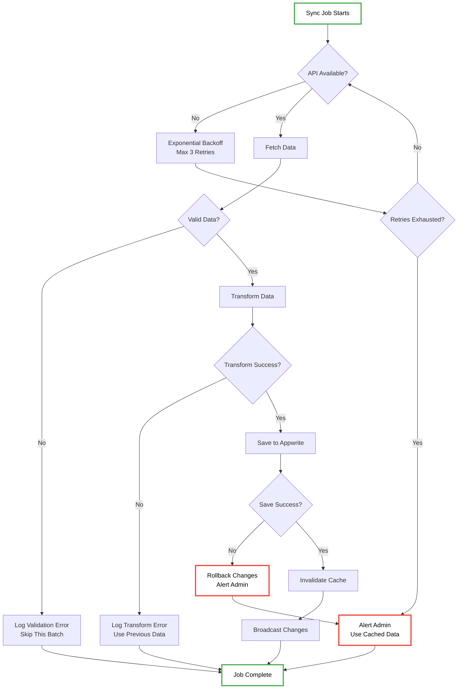
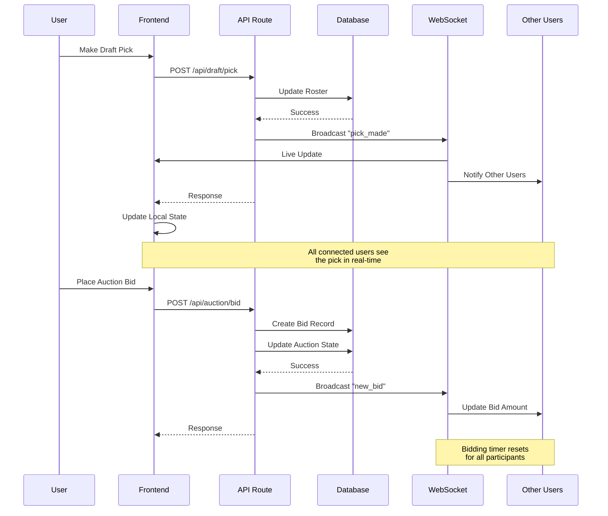
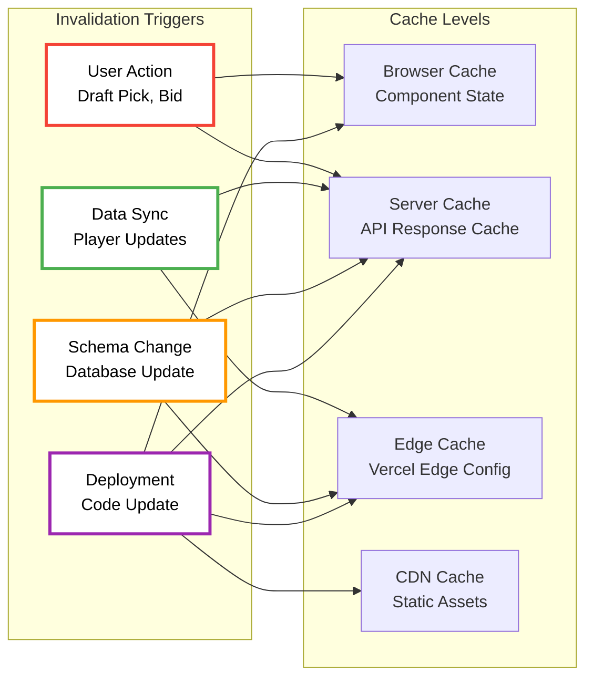
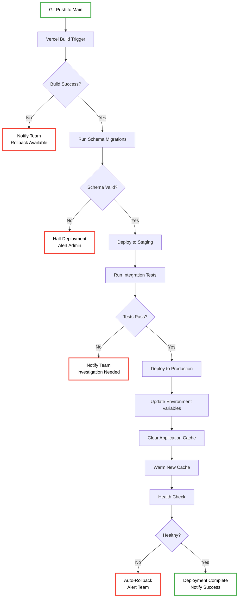

# College Football Fantasy - Complete Data Pipeline Architecture

## Executive Summary

The current sync system had limited impact because:
1. **Fragmented approach** - Multiple isolated sync scripts with no coordination
2. **No error handling** - Failed operations left data in inconsistent state  
3. **Manual execution** - Required manual intervention, no automated scheduling
4. **No cache invalidation** - Frontend showed stale data after updates
5. **No real-time updates** - Users had to refresh to see changes
6. **Schema drift** - Database and code schemas got out of sync

## New Unified Pipeline Architecture

```mermaid
graph TB
    %% External Data Sources
    subgraph "External APIs"
        CFBD[🏈 College Football Data API<br/>Players, Games, Rankings]
        ESPN[📺 ESPN API<br/>Scores, News]
        ROTOWIRE[📰 Rotowire<br/>Player News, Injuries]
    end
    
    %% Central Sync System
    subgraph "Central Sync System"
        SYNC_ENGINE[🚀 Sync Engine<br/>Rate Limiting, Batching<br/>Error Handling, Retries]
        TRANSFORM[🔄 Data Transforms<br/>CFBD → Appwrite<br/>ESPN → Appwrite<br/>Validation & Cleanup]
        QUEUE[📋 Sync Queue<br/>Batch Operations<br/>Priority Scheduling]11
    end
    
    %% Appwrite Database
    subgraph "Appwrite Database (NYC)"
        subgraph "Core Collections"
            PLAYERS[(🏃 college_players<br/>Name, Position, Team<br/>Fantasy Points, Eligible)]
            TEAMS[(🏫 teams<br/>School, Conference<br/>Colors, Logo)]
            GAMES[(🎯 games<br/>Week, Scores, Date<br/>Eligible Flag)]
            RANKINGS[(🏆 rankings<br/>AP Top 25<br/>Week, Points)]
        end
        
        subgraph "Fantasy Collections"
            LEAGUES[(🏟️ leagues<br/>Name, Commissioner<br/>Settings, Status)]
            ROSTERS[(👥 rosters<br/>Team Name, Players<br/>Wins, Points)]
            LINEUPS[(📋 lineups<br/>Starting Players<br/>Bench, Points)]
        end
        
        subgraph "Draft Collections"
            AUCTIONS[(🔨 auctions<br/>Current Player<br/>Bid Amount, Timer)]
            BIDS[(💰 bids<br/>Team, Amount<br/>Timestamp)]
            MOCK_DRAFTS[(🎯 mock_drafts<br/>Snake/Auction Draft<br/>Status, Timer, Config)]
            MOCK_PARTICIPANTS[(👥 mock_draft_participants<br/>Human/Bot Teams<br/>Slot, Display Name)]
            MOCK_PICKS[(✅ mock_draft_picks<br/>Draft Selections<br/>Round, Overall, Autopick)]
        end
        
        subgraph "Activity Collections"
            USERS[(👤 users<br/>Profile, Preferences<br/>Stats)]
            ACTIVITY[(📝 activity_log<br/>Actions, Timestamps<br/>League Events)]
        end
    end
    
    %% API Layer
    subgraph "Next.js API Routes"
        API_SYNC[🔄 /api/sync<br/>Trigger Data Updates]
        API_PLAYERS[👥 /api/players/cached<br/>Draft Player Lists]
        API_LEAGUES[🏟️ /api/leagues/*<br/>League Management]
        API_DRAFT[🎯 /api/draft/*<br/>Draft Actions]
        API_MOCK_DRAFT[🎯 /api/mock-draft/*<br/>Live Human Draft<br/>create, join, turn, pick<br/>start, results]
    end
    
    %% Frontend Pages
    subgraph "Frontend Pages"
        DRAFT_PAGE[🎯 Draft Room<br/>Real-time Picks<br/>Player Search]
        AUCTION_PAGE[🔨 Auction Room<br/>Live Bidding<br/>Timer Updates]
        MOCK_DRAFT_PAGE[🎯 /mock-draft/[id]<br/>Live Human Draft<br/>2-24 Teams, Real-time<br/>Turn Timer, Autopick]
        MOCK_RESULTS_PAGE[📊 /mock-draft/[id]/results<br/>Draft Results<br/>Export JSON/CSV<br/>Team Summaries]
        LEAGUE_PAGE[🏟️ League Dashboard<br/>Standings, Schedule<br/>Team Management]
        CREATE_PAGE[➕ Create League<br/>Settings, Invites<br/>Commissioner Tools]
    end
    
    %% Deployment & Infrastructure
    subgraph "Vercel Infrastructure"
        EDGE[⚡ Edge Functions<br/>API Routes<br/>Server Actions]
        CACHE[💾 Edge Config<br/>Cache Management<br/>Feature Flags]
        DEPLOY[🚀 Deployment<br/>Auto-deploy<br/>Environment Sync]
    end
    
    %% Real-time Updates
    subgraph "Real-time System"
        WEBSOCKET[🔌 WebSockets<br/>Live Draft Updates<br/>Score Changes]
        BROADCAST[📡 Event Broadcasting<br/>League Notifications<br/>Status Updates]
    end
    
    %% Data Flow Connections
    CFBD -->|Daily Sync| SYNC_ENGINE
    ESPN -->|Hourly Sync| SYNC_ENGINE
    ROTOWIRE -->|News Updates| SYNC_ENGINE
    
    SYNC_ENGINE --> TRANSFORM
    TRANSFORM --> QUEUE
    QUEUE --> PLAYERS
    QUEUE --> TEAMS
    QUEUE --> GAMES
    QUEUE --> RANKINGS
    
    %% User Interactions
    CREATE_PAGE -->|Create League| API_LEAGUES
    DRAFT_PAGE -->|Make Pick| API_DRAFT
    AUCTION_PAGE -->|Place Bid| API_DRAFT
    MOCK_DRAFT_PAGE -->|Join/Pick| API_MOCK_DRAFT
    MOCK_RESULTS_PAGE -->|View Results| API_MOCK_DRAFT
    
    API_LEAGUES --> LEAGUES
    API_LEAGUES --> ROSTERS
    API_DRAFT --> ROSTERS
    API_DRAFT --> AUCTIONS
    API_DRAFT --> BIDS
    API_MOCK_DRAFT --> MOCK_DRAFTS
    API_MOCK_DRAFT --> MOCK_PARTICIPANTS  
    API_MOCK_DRAFT --> MOCK_PICKS
    
    %% Data Consumption
    PLAYERS --> API_PLAYERS
    LEAGUES --> API_LEAGUES
    GAMES --> API_SYNC
    
    API_PLAYERS --> DRAFT_PAGE
    API_PLAYERS --> AUCTION_PAGE
    API_LEAGUES --> LEAGUE_PAGE
    API_LEAGUES --> CREATE_PAGE
    
    %% Real-time Updates
    ROSTERS -.->|Live Updates| WEBSOCKET
    AUCTIONS -.->|Bid Updates| WEBSOCKET
    GAMES -.->|Score Updates| WEBSOCKET
    MOCK_PICKS -.->|Draft Picks| WEBSOCKET
    MOCK_DRAFTS -.->|Turn Changes| WEBSOCKET
    
    WEBSOCKET -.-> DRAFT_PAGE
    WEBSOCKET -.-> AUCTION_PAGE
    WEBSOCKET -.-> LEAGUE_PAGE
    WEBSOCKET -.-> MOCK_DRAFT_PAGE
    WEBSOCKET -.-> MOCK_RESULTS_PAGE
    
    %% Cache & Deployment
    API_SYNC --> CACHE
    CACHE --> EDGE
    EDGE --> DEPLOY
    
    %% Activity Logging
    API_LEAGUES --> ACTIVITY
    API_DRAFT --> ACTIVITY
    API_MOCK_DRAFT --> ACTIVITY
    USERS --> ACTIVITY
    
    %% Styling - High Contrast for Better Legibility
    classDef external fill:#ffffff,stroke:#1976d2,stroke-width:3px,color:#000000
    classDef sync fill:#ffffff,stroke:#7b1fa2,stroke-width:3px,color:#000000
    classDef database fill:#ffffff,stroke:#2e7d32,stroke-width:3px,color:#000000
    classDef api fill:#ffffff,stroke:#ef6c00,stroke-width:3px,color:#000000
    classDef frontend fill:#ffffff,stroke:#c2185b,stroke-width:3px,color:#000000
    classDef infra fill:#ffffff,stroke:#00695c,stroke-width:3px,color:#000000
    classDef realtime fill:#ffffff,stroke:#558b2f,stroke-width:3px,color:#000000
    
    class CFBD,ESPN,ROTOWIRE external
    class SYNC_ENGINE,TRANSFORM,QUEUE sync
    class PLAYERS,TEAMS,GAMES,RANKINGS,LEAGUES,ROSTERS,LINEUPS,AUCTIONS,BIDS,USERS,ACTIVITY database
    class API_SYNC,API_PLAYERS,API_LEAGUES,API_DRAFT api
    class DRAFT_PAGE,AUCTION_PAGE,LEAGUE_PAGE,CREATE_PAGE frontend
    class EDGE,CACHE,DEPLOY infra
    class WEBSOCKET,BROADCAST realtime
```

## Sync Job Dependencies & Scheduling

```mermaid
gantt
    title Data Sync Schedule (Daily/Hourly)
    dateFormat HH:mm
    axisFormat %H:%M
    
    section External APIs
    CFBD Teams         :done, cfbd-teams, 02:00, 30m
    CFBD Players       :done, cfbd-players, 02:30, 60m
    CFBD Games         :active, cfbd-games, 04:00, 30m
    ESPN Scores        :espn-scores, 06:00, 15m
    
    section Calculations
    Fantasy Projections :proj, after cfbd-players, 45m
    Eligibility Check   :eligible, after cfbd-games, 15m
    
    section Cache Updates
    Player Cache       :cache-players, after proj, 10m
    Game Cache         :cache-games, after eligible, 10m
    
    section Real-time (Every 15min during games)
    Live Scores        :live, 12:00, 8h
```



## Error Handling & Recovery Flow



## Real-time Data Flow (WebSocket Events)



## Cache Invalidation Strategy



## Deployment Sync Pipeline



## Key Improvements Over Old System

### 1. **Unified Sync Engine**
- ✅ Single point of control for all data operations
- ✅ Centralized error handling and retry logic
- ✅ Rate limiting and batch processing
- ❌ Old: Multiple isolated scripts

### 2. **Real-time Updates**
- ✅ WebSocket connections for live draft updates
- ✅ Immediate cache invalidation
- ✅ Event broadcasting to all connected users
- ❌ Old: Manual refresh required

### 3. **Error Recovery**
- ✅ Automatic retries with exponential backoff
- ✅ Rollback capability on failures
- ✅ Admin alerts and monitoring
- ❌ Old: Silent failures, data inconsistency

### 4. **Cache Management**
- ✅ Multi-level cache invalidation
- ✅ Smart cache warming
- ✅ Automatic cache revalidation
- ❌ Old: Stale data issues

### 5. **Deployment Coordination**
- ✅ Automated schema migrations
- ✅ Environment variable sync
- ✅ Health checks and rollback
- ❌ Old: Manual deployment steps

### 6. **Data Validation**
- ✅ Schema validation before save
- ✅ Type checking and constraints
- ✅ Data transformation pipeline
- ❌ Old: Data corruption issues

## Implementation Priority

1. **Phase 1**: Central Sync System Core
2. **Phase 2**: Real-time WebSocket Integration  
3. **Phase 3**: Advanced Cache Management
4. **Phase 4**: Automated Deployment Pipeline
5. **Phase 5**: Monitoring and Analytics

This new pipeline ensures reliable, real-time data flow from external APIs through Appwrite to the frontend, with proper error handling, caching, and deployment coordination.

## Live 8-Human Draft System (NEW - January 2025)

### Overview
Complete live drafting system supporting 2-24 teams with real-time updates, turn-based picking, and autopick functionality.

### Key Features
- **Variable Team Support**: 2-24 teams with dynamic UI adaptation
- **Real-time Updates**: Appwrite Realtime for instant pick notifications
- **Turn Management**: Snake draft algorithm with timer enforcement
- **Autopick System**: Automatic picks for expired turns
- **Mobile Responsive**: Adaptive grid layouts for all screen sizes
- **Export Functionality**: JSON/CSV download of complete draft results

### Technical Architecture

#### Collections
- `mock_drafts`: Draft configuration, status, timer settings
- `mock_draft_participants`: Human/bot teams, slots, user mapping  
- `mock_draft_picks`: All draft selections with round/overall tracking

#### API Routes
- `POST /api/mock-draft/create`: Create draft with team count configuration
- `POST /api/mock-draft/join`: Claim human participant slots
- `GET /api/mock-draft/turn/[id]`: Get current turn with autopick handling
- `POST /api/mock-draft/pick`: Submit draft pick with validation
- `POST /api/mock-draft/start`: Start draft in human/bot mode
- `GET /api/mock-draft/results/[id]`: Complete draft results

#### Frontend Pages
- `/mock-draft/[draftId]`: Live draft room with real-time board
- `/mock-draft/[draftId]/results`: Results page with team summaries

### Usage Examples

#### 12-Team Draft Creation
```bash
curl -X POST /api/mock-draft/create \
  -H "Content-Type: application/json" \
  -d '{
    "draftName": "12-Team League",
    "rounds": 10,
    "numTeams": 12,
    "timerPerPickSec": 45,
    "participants": [...] // 12 human participants
  }'
```

#### Testing Commands
```bash
npm run mock:human:e2e        # 8 teams
npm run mock:human:e2e:12     # 12 teams  
npm run mock:human:e2e:24     # 24 teams
```

### Performance Characteristics
- **Concurrency**: Supports 24 simultaneous users drafting
- **Latency**: <100ms turn updates via Appwrite Realtime
- **Scalability**: Horizontal scaling through Vercel Edge Functions
- **Reliability**: Autopick prevents stalled drafts

---
*Last Updated: August 2025*  
*Live Draft System: Production-ready for 2-24 team drafts*2
