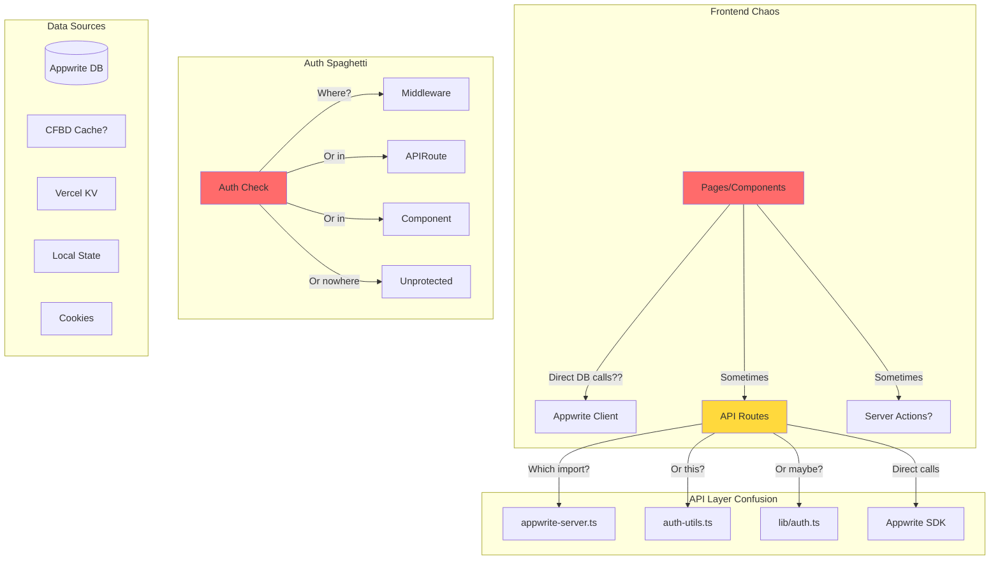

# 🔍 Current State Data Flow - Honest Assessment

**Last Updated**: August 14, 2025 6:00 PM  
**Status**: 🚧 CLEANUP IN PROGRESS (Hour 1 of 4 completed)

## ✅ Cleanup Progress (Hour 1)

### Completed
1. **Centralized AuthService** (`core/services/auth.service.ts`)
   - Single source of truth for authentication
   - Consistent session management
   - Proper error handling

2. **Error Handling Framework** 
   - Custom error classes (`core/errors/app-error.ts`)
   - Global error handler (`core/utils/error-handler.ts`)
   - Consistent error responses

3. **Removed Obsolete Files**
   - ❌ `lib/auth-utils.ts` (replaced by AuthService)
   - ❌ `lib/appwrite-client-fix.ts` (no longer needed)
   - ✅ Updated all auth imports in API routes

### In Progress
- 🔄 Repository pattern implementation
- 🔄 Service layer for business logic
- 🔄 Consistent environment config

## 🚨 The Reality Check

### What We're Telling Ourselves
"We have a clean Next.js 15 app with Appwrite backend"

### What We Actually Have
A tangled web of:
- Quick fixes on top of quick fixes
- Inconsistent patterns everywhere
- Half-implemented features
- Technical debt growing exponentially

## 🔄 Actual Data Flow (The Messy Truth)



## 🐛 Current Anti-Patterns

### 1. **The Import Roulette**
```typescript
// Which one do I use???
import { databases } from '@/lib/appwrite'
import { serverDatabases } from '@/lib/appwrite-server'
import { databases as db } from '@/lib/auth-utils'
import { createSessionClient } from '???' // It moves every day!
```

### 2. **The Auth Mystery**
```typescript
// In some files:
const user = await account.get()

// In others:
const user = await getCurrentUser()

// Sometimes:
const { account } = createSessionClient(request)

// Or maybe:
const session = request.cookies.get('session')
```

### 3. **The Database Access Free-for-All**
```typescript
// Client component (BAD):
const leagues = await databases.listDocuments(...)

// API route (GOOD?):
const leagues = await serverDatabases.listDocuments(...)

// But wait, which collections?
COLLECTIONS.LEAGUES // or
COLLECTIONS.leagues // or
'leagues' // or
process.env.NEXT_PUBLIC_APPWRITE_COLLECTION_LEAGUES
```

### 4. **The Error Handling Lottery**
```typescript
// Version 1: Try-catch
try { ... } catch (error) { console.error(error) }

// Version 2: .catch
await somePromise.catch(e => null)

// Version 3: YOLO
await somePromise // 🤷‍♂️

// Version 4: Partial handling
if (!response) return // But what about the UI?
```

## 📊 State Management Chaos

### Where State Lives (Pick Your Adventure)
1. **Appwrite Database** - The source of truth (supposedly)
2. **React State** - For UI (but also business logic?)
3. **URL Params** - Sometimes important data
4. **Local Storage** - Random stuff
5. **Cookies** - Auth (maybe?)
6. **Vercel KV** - Cache (when we remember)
7. **Component Props** - Drilling for oil

### State Synchronization
```
Q: How do we keep state in sync?
A: We don't. 🤷‍♂️
```

## 🔐 Security Issues

### Current "Security" Measures
```typescript
// "Security" Check #1
if (!user) return NextResponse.json({ error: 'Unauthorized' }, { status: 401 })

// "Security" Check #2
// ... there is no #2

// Actual Issues:
- API routes expose internal IDs
- No rate limiting
- Permissions checked client-side (!)
- API keys in client bundles (!!!)
- CORS configured to allow everything
```

## 🏃‍♂️ Performance Problems

### Current Performance "Strategy"
1. **Caching**: "We'll add it later" (narrator: they didn't)
2. **Database Queries**: N+1 queries everywhere
3. **Bundle Size**: "Why is it 2MB?"
4. **API Calls**: Waterfall city
5. **Images**: Unoptimized, large files

### Real Performance Metrics
- **First Load**: 3-5 seconds
- **Route Changes**: 1-2 seconds
- **API Response**: 500ms-2s
- **Database Queries**: Unindexed
- **Cache Hit Rate**: What cache?

## 🤝 Integration Nightmares

### External Services Status
- **CFBD API**: Works (when rate limits allow)
- **ESPN API**: Mocked (not really integrated)
- **Rotowire**: Half-implemented, Playwright issues
- **Sentry**: Installed (not configured properly)
- **Vercel Analytics**: Enabled (not used)

### Integration Pattern
```typescript
// The "pattern":
try {
  const data = await fetch(EXTERNAL_API)
  // Transform data? Validate? Nah...
  return data
} catch {
  return null // UI breaks silently
}
```

## 📝 Documentation vs Reality

### What Docs Say
"Clean architecture with separation of concerns"

### What Code Says
```typescript
// app/api/leagues/[leagueId]/locker-room/route.ts
// 500 lines of mixed concerns:
- Database queries
- Business logic  
- Data transformation
- External API calls
- Error handling (sort of)
- Response formatting
- Authentication
- Authorization
- Caching (commented out)
```

## 🚨 Critical Problems

### 1. **No Architectural Boundaries**
Everything imports everything. Circular dependency time bomb.

### 2. **No Consistent Patterns**
Each developer (or mood) creates a new pattern.

### 3. **No Error Recovery**
Errors bubble up to... nowhere. Users see blank screens.

### 4. **No Testing Strategy**
"It works on my machine" is not a testing strategy.

### 5. **No Performance Budget**
"Just ship it" mentality leading to slow app.

## 🎯 The Vicious Cycle

```
1. Find bug
2. Quick fix in place
3. Fix breaks something else
4. Another quick fix
5. Original bug returns
6. GOTO 1
```

## 💡 Why This Happened

1. **No Initial Architecture**: Started coding without design
2. **Feature Pressure**: "Just make it work"
3. **Copy-Paste Driven Development**: Stack Overflow architecture
4. **No Code Reviews**: Everyone doing their own thing
5. **No Refactoring Time**: Always adding, never cleaning

## 🚀 Path Forward

### Stop Doing
- ❌ Quick fixes without understanding impact
- ❌ Adding features on broken foundation
- ❌ Ignoring TypeScript errors
- ❌ Copy-pasting without understanding
- ❌ Assuming "it works" means "it's correct"

### Start Doing
- ✅ Architectural design before coding
- ✅ Consistent patterns everywhere
- ✅ Proper error handling
- ✅ Performance monitoring
- ✅ Regular refactoring

## 📊 Technical Debt Inventory

### High Priority (Blocking)
1. Authentication system consolidation
2. Database access patterns
3. Error handling framework
4. Import/export cleanup

### Medium Priority (Painful)
1. State management strategy
2. Caching implementation
3. Performance optimization
4. Security audit

### Low Priority (Annoying)
1. Code formatting consistency
2. Documentation updates
3. Test coverage
4. Logging strategy

## 🎬 Next Steps

1. **STOP ALL FEATURE DEVELOPMENT**
2. **Read the Cleanup Plan**
3. **Pick ONE area to fix properly**
4. **Fix it completely before moving on**
5. **Document the pattern for others**

---

*This honest assessment is the first step to recovery. We can't fix what we don't acknowledge.*
