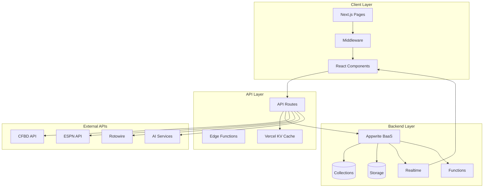
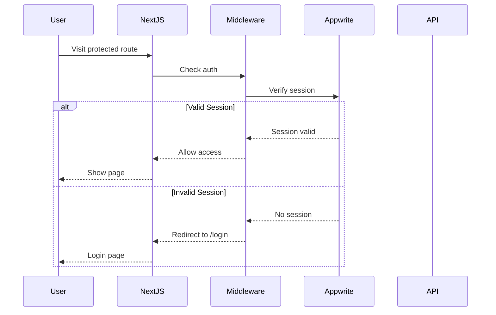
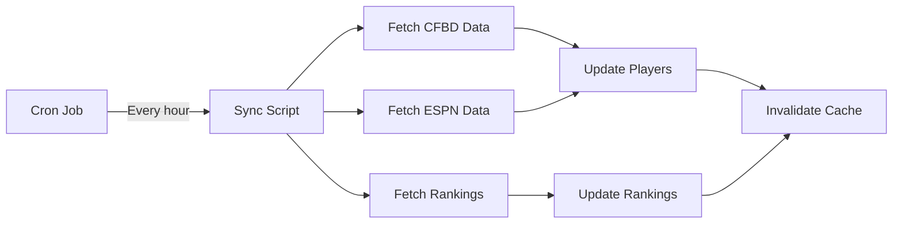

# Data Flow Architecture

**Last Updated**: 8/14/2025 1:15:00 PM
**Next Update**: 1:45:00 PM (30 min cycle)

## 🔄 High-Level Data Flow



## 📊 Database Schema

### Core Collections

#### 1. **users** (Appwrite Auth)
```typescript
{
  $id: string,
  email: string,
  name: string,
  prefs: {
    favoriteTeam?: string,
    notifications?: boolean
  }
}
```

#### 2. **leagues**
```typescript
{
  $id: string,
  name: string,
  commissionerId: string,
  maxTeams: number,
  isPublic: boolean,
  inviteCode: string,
  draftDate?: string,
  scoringRules: string, // JSON: all commissioner settings
  pickTimeSeconds: number,
  $createdAt: string,
  $updatedAt: string
}
```

#### 3. **rosters** (formerly teams)
```typescript
{
  $id: string,
  leagueId: string,
  userId: string,
  teamName: string,
  abbreviation: string,
  primaryColor: string,
  secondaryColor: string,
  logoId?: string,
  wins: number,
  losses: number,
  ties: number,
  pointsFor: number,
  pointsAgainst: number
}
```

#### 4. **players**
```typescript
{
  $id: string,
  espnId: string,
  cfbdId?: string,
  firstName: string,
  lastName: string,
  displayName: string,
  jersey?: string,
  position: object,
  team: string,
  conference: string,
  isActive: boolean,
  fantasyPoints: number
}
```

#### 5. **draft_picks**
```typescript
{
  $id: string,
  leagueId: string,
  round: number,
  pick: number,
  overallPick: number,
  teamId: string,
  playerId: string,
  timestamp: string
}
```

## 🔐 Authentication Flow



## 📡 Real-time Data Flow

### Draft Updates
```typescript
// Subscribe
const unsubscribe = client.subscribe(
  `databases.${DATABASE_ID}.collections.${COLLECTIONS.DRAFT_PICKS}.documents`,
  (response) => {
    // Update UI with new pick
  }
);

// Publish (via API)
await databases.createDocument(
  DATABASE_ID,
  COLLECTIONS.DRAFT_PICKS,
  ID.unique(),
  pickData
);
```

### Commissioner Settings Updates
```typescript
// Save consolidated settings
const allSettings = {
  scoringRules,
  scheduleSettings,
  playoffSettings,
  theme,
  draftSettings,
  leagueSettings
};

await databases.updateDocument(
  DATABASE_ID,
  COLLECTIONS.LEAGUES,
  leagueId,
  { scoringRules: JSON.stringify(allSettings) }
);
```

## 🚀 API Route Patterns

### Client-Side Routes
```typescript
// Uses public Appwrite client
import { databases } from '@/lib/appwrite';

export async function GET(request: NextRequest) {
  const docs = await databases.listDocuments(
    DATABASE_ID,
    COLLECTIONS.LEAGUES
  );
  return NextResponse.json(docs);
}
```

### Server-Side Routes
```typescript
// Uses Appwrite with API key
import { serverDatabases as databases } from '@/lib/appwrite-server';

export async function POST(request: NextRequest) {
  const data = await request.json();
  const doc = await databases.createDocument(
    DATABASE_ID,
    COLLECTIONS.LEAGUES,
    ID.unique(),
    data
  );
  return NextResponse.json(doc);
}
```

## 🗄️ Caching Strategy

### Vercel KV Cache
```typescript
// Cache player data
await kv.setex(
  `players:${conference}`,
  3600, // 1 hour TTL
  JSON.stringify(players)
);

// Read from cache
const cached = await kv.get(`players:${conference}`);
if (cached) return NextResponse.json(cached);
```

### Cache Keys
- `players:{conference}` - Conference players (1hr)
- `rankings:week:{week}` - AP rankings (6hr)
- `games:{week}` - Weekly games (1hr)
- `league:{leagueId}` - League data (5min)

## 🔄 Data Sync Patterns

### External API Sync


### Permissions Model
```typescript
// Collection Permissions
{
  leagues: ['read("users")', 'create("users")', 'update("team:owner")'],
  rosters: ['read("users")', 'create("users")', 'update("team:member")'],
  players: ['read("users")'],
  draft_picks: ['read("users")', 'create("users")']
}
```

## 🎯 Performance Optimizations

### Edge Functions
- All API routes run on Vercel Edge
- Global distribution for low latency
- Automatic scaling

### Database Queries
```typescript
// Optimized queries with indexes
[
  Query.equal('leagueId', leagueId),
  Query.orderDesc('$createdAt'),
  Query.limit(100)
]
```

### Image Optimization
```typescript
// Team logos via Appwrite Storage
const logoUrl = storage.getFilePreview(
  'team-logos',
  logoId,
  300, // width
  300, // height
  'center' // gravity
);
```

## 🚨 Error Handling

### API Error Responses
```typescript
try {
  // Operation
} catch (error) {
  if (error.code === 401) {
    return NextResponse.json(
      { error: 'Unauthorized' },
      { status: 401 }
    );
  }
  return NextResponse.json(
    { error: 'Internal Server Error' },
    { status: 500 }
  );
}
```

### Client Error Boundaries
```typescript
<ErrorBoundary fallback={<ErrorUI />}>
  <Component />
</ErrorBoundary>
```

## 📈 Monitoring & Observability

### Health Checks
- `/api/health` - System status
- Appwrite connection test
- Collection availability check
- Environment validation

### Sentry Integration
- Automatic error capture
- Performance monitoring
- User context
- Release tracking

### Vercel Analytics
- Web vitals tracking
- User analytics
- Performance insights
- Error rate monitoring

## 🔮 Upcoming Data Flow Changes

1. **PWA Offline Support**
   - IndexedDB for offline storage
   - Service worker caching
   - Sync on reconnect

2. **AI Integration**
   - Claude API for draft advice
   - GPT-4 for analysis
   - Streaming responses

3. **Enhanced Caching**
   - ISR for static pages
   - Edge caching
   - Stale-while-revalidate

---
*Next update scheduled for: August 14, 2025 12:07 PM*
