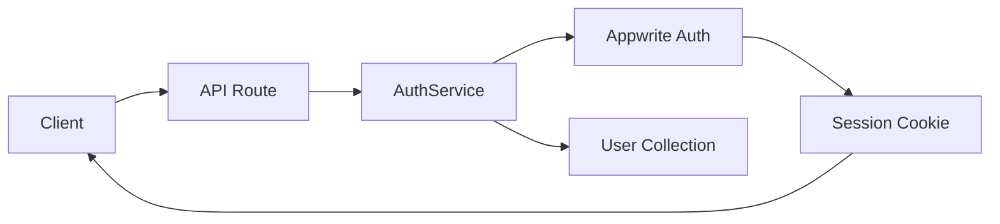
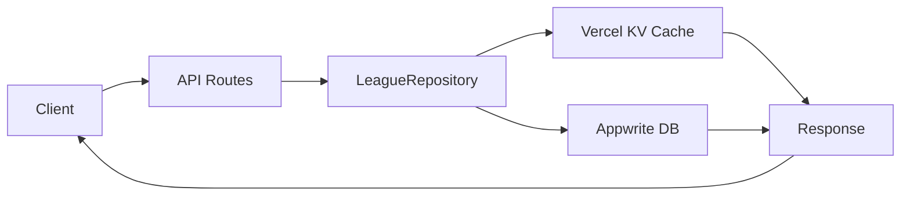
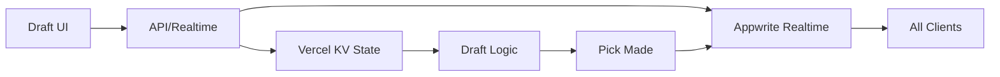
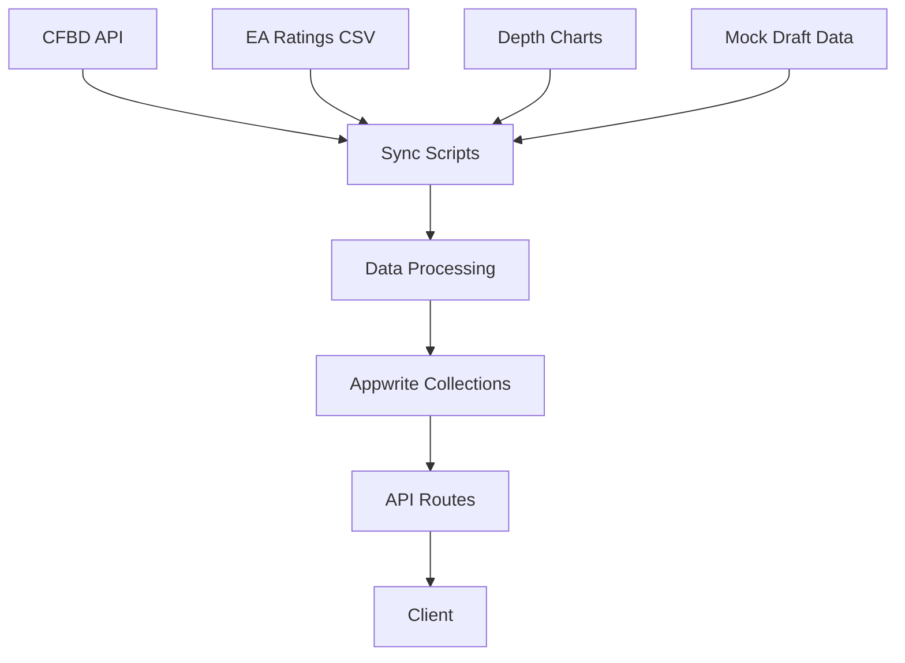
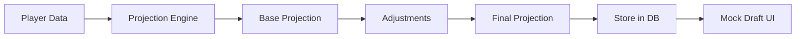
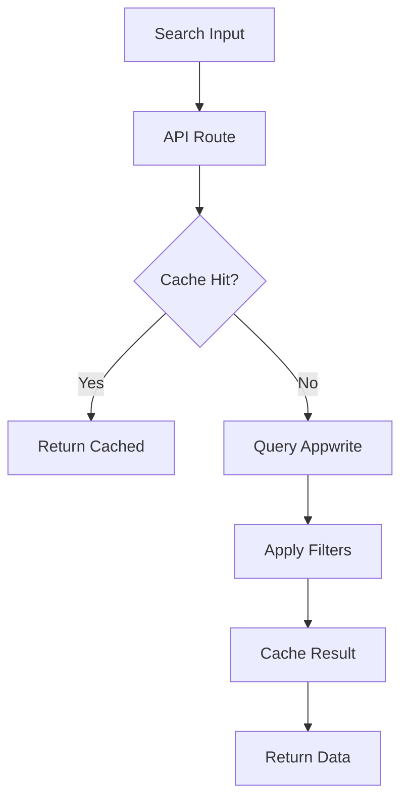

# College Football Fantasy App - Data Flow Architecture

## 🔄 Core Data Flows

### 1. Authentication Flow


**Key Points:**
- All auth operations go through centralized `AuthService`
- Sessions stored in secure `appwrite-session` cookies
- OAuth providers: Google, Apple
- User profiles synced to Appwrite

### 2. League Management Flow


**Key Operations:**
- Create league → Store in Appwrite → Invalidate cache
- Join league → Check capacity → Add member → Update cache
- Search leagues → Query with filters → Cache results
- Commissioner actions → Verify permissions → Execute → Broadcast

### 3. Draft Flow (Real-time)


**Components:**
- **Draft State**: Current pick, timer, rosters in KV
- **Player Pool**: ~3000+ Power 4 players from Appwrite
- **Real-time Updates**: Via Appwrite Realtime channels
- **Auto-pick**: Timer-based with BPA (Best Player Available)

### 4. Player Data Pipeline


**Data Sources:**
- **CFBD**: Rosters, stats, games, rankings
- **EA Sports**: Player ratings (normalized)
- **Depth Charts**: Position rankings
- **Mock Drafts**: ADP calculations

### 5. Projections System


**Calculation Factors:**
- EA rating (60-99 scale)
- Previous season stats
- Depth chart position
- Strength of schedule
- Conference multipliers

### 6. Search & Filter Flow


**Search Capabilities:**
- Player name, team, conference, position
- League name and settings
- Full-text search with fallbacks
- Cached for performance

## 🗄️ Database Collections

### Core Collections
1. **users** - User profiles and preferences
2. **leagues** - League settings and metadata
3. **rosters** - Team rosters and ownership
4. **college_players** - Player database (~3000+)
5. **player_stats** - Historical performance
6. **games** - Schedule and scores
7. **rankings** - AP Top 25 weekly
8. **projections_yearly** - Season projections
9. **projections_weekly** - Week-by-week projections
10. **model_inputs** - Projection model data

### Relationships
- `leagues` → `rosters` (1:many)
- `rosters` → `users` (many:1)
- `rosters` → `college_players` (many:many)
- `games` → `rankings` (temporal)
- `college_players` → `player_stats` (1:many)

## 🚀 Performance Optimizations

### Caching Strategy
```typescript
// Vercel KV Cache Layers
- L1: Player data (24h TTL)
- L2: League listings (1h TTL)
- L3: Draft state (real-time)
- L4: Rankings/Games (6h TTL)
```

### Query Optimization
- Indexed fields: `name`, `team`, `conference`, `position`, `draftable`
- Compound indexes for common queries
- Limit/offset pagination
- Lazy loading for large datasets

### Real-time Channels
```typescript
// Appwrite Realtime Subscriptions
- draft.picks.[leagueId]
- league.updates.[leagueId]
- auction.bids.[leagueId]
- player.projections
```

## 🔐 Security Layers

1. **API Routes**: Server-side validation
2. **Appwrite Rules**: Collection-level permissions
3. **Repository Pattern**: Consistent access control
4. **Environment Variables**: Secure configuration
5. **CORS**: Configured for production domains

## 📊 Data Sync Schedule

- **Hourly**: Live game scores (during season)
- **Daily**: Player stats, depth charts
- **Weekly**: Rankings, projections
- **As Needed**: Roster changes, injuries

## 🛠️ Error Handling

### Client Errors
- 400: Validation errors → Show form feedback
- 401: Unauthorized → Redirect to login
- 403: Forbidden → Show permission error
- 404: Not found → Show friendly 404

### Server Errors
- 500: Internal error → Log to Sentry
- 502: Appwrite down → Show maintenance
- 503: Rate limited → Implement backoff

## 📈 Monitoring

- **Vercel Analytics**: Page views, performance
- **Sentry**: Error tracking and alerts
- **Appwrite Dashboard**: Database metrics
- **Custom Logging**: API usage patterns

---

Last Updated: August 2025