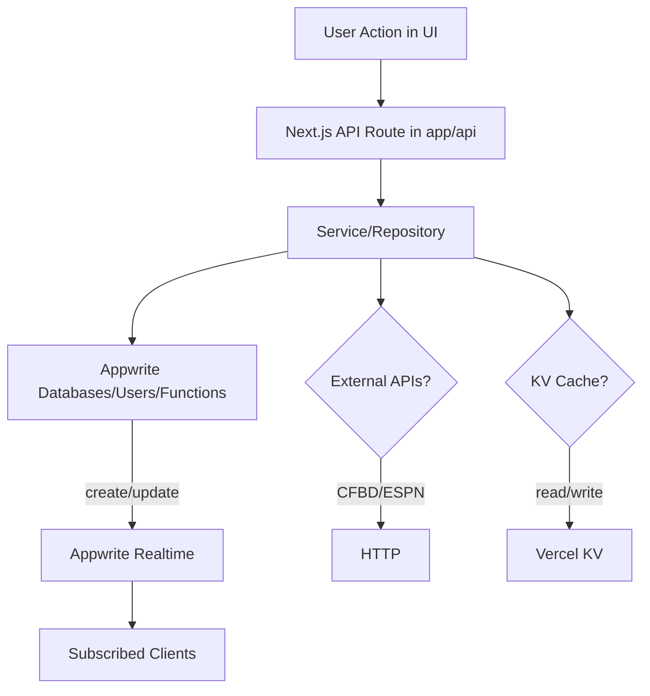
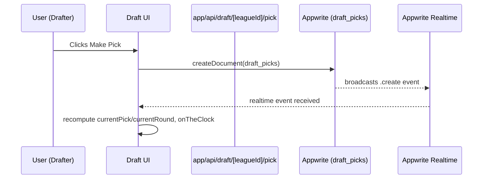

## ⚠️ DEPRECATED - See Root PROJECT_MAP.md

**This file is deprecated**. The consolidated project map is now at:
**📍 `/PROJECT_MAP.md` (root level)**

The new map includes:
- 📁 Repository structure diagram
- 🔄 Data flow architecture  
- 🎯 Single Source of Truth documentation
- ✅ Current consolidated status

---

## Legacy Content (Archived Below)

### Tech Overview
- **Frontend**: Next.js 15 App Router (TypeScript, Tailwind)
- **Backend**: Next API routes, Appwrite (databases, auth, storage, functions, realtime)
- **Data**: Appwrite Collections, Vercel KV (optional cache), CFBD + ESPN APIs
- **Realtime**: Appwrite Realtime (draft, auctions, league updates)
- **Jobs**: Appwrite Functions + Next cron routes (weekly scoring, sync)

---

## Directory Map (What/Where)

- `app/`
  - App Router pages and API routes. Server Components by default, `use client` where needed.
  - Key subfolders:
    - `app/api/`: All API endpoints. See full list in `docs/API_ROUTES.md`.
    - `app/draft/`, `app/auction/`, `app/league/`: Feature pages.
    - `app/global-error.tsx`: Global error boundary.

- `components/`
  - UI components organized by feature (`draft/`, `auction/`, `league/`, `ui/`, etc.).
  - Examples: `components/draft/DraftBoard.tsx`, `components/auction/AuctionBoard.tsx`.

- `schema/`
  - **SINGLE SOURCE OF TRUTH** for all database schemas, types, and validation
  - `schema/zod-schema.ts`: Canonical schema definitions, collection registry, validation utilities
  - `schema/README.md`: Schema management documentation and workflows

- `core/`
  - Domain-level configuration, errors, and services.
  - `core/config/environment.ts`: Environment configuration (references schema SSOT)
  - `core/services/auth.service.ts`: Central auth/session service (client + server modes)
  - `core/errors/`: Typed error utilities

- `lib/`
  - Appwrite clients, typed API clients, feature services, utilities.
  - `lib/appwrite.ts`: Browser Appwrite client + `DATABASE_ID`, `COLLECTIONS`, realtime channel helpers.
  - `lib/appwrite-server.ts`: Server Appwrite client (API key) + `serverDatabases`, `serverUsers`, etc.
  - `lib/api/`: Typed HTTP client wrappers used by the frontend (e.g., `lib/api/games.ts`).
  - `lib/services/`: Feature services (e.g., `projections.service.ts`, `cfb-projections.service.ts`).

- `hooks/`
  - React hooks for auth and realtime (e.g., `useDraftRealtime.ts`, `useAuth.ts`).

- `types/`
  - TypeScript types and shared interfaces (e.g., `draft.ts`, `auction.ts`, `game.ts`, `projections.ts`).

- `functions/`
  - Projected calculations and utilities intended for server-side execution (Node/Edge).

- `appwrite-functions/`
  - Appwrite Function projects (e.g., `weekly-scoring/`, `draft-reminder/`).

- `scripts/`
  - One-off and maintenance scripts (env alignment, migrations, index setup, data backfills).

- `data/`
  - Static data sources and processed CSV/JSON (ratings, pace, FEI/SP+, mock draft, depth, etc.).

- `workers/`
  - Containers and worker code (e.g., `live_worker.py`) for background processing.

- `vendor/`
  - External subprojects (e.g., `awwwards-rig` 3D mascot tooling).

- `docs/`
  - Canonical documentation. Start at `docs/README.md`.
  - Memory: `docs/PROJECT_CANONICAL_MEMORY.md` (archived plans in `docs/archive/`).

---

## Single Source of Truth (SSOT) Architecture

- `schema/zod-schema.ts` - **THE CANONICAL SOURCE**
  - All collection names, schemas, and validation rules
  - Exports `COLLECTIONS`, `SCHEMA_REGISTRY`, `validateData()` 
  - Generates TypeScript types automatically via Zod inference

- `lib/appwrite.ts` - Frontend Client
  - Browser Appwrite client; exports `databases`, `storage`, `functions`, `avatars`
  - Imports `COLLECTIONS` and `DATABASE_ID` from schema SSOT
  - Exports realtime channel helpers

- `lib/appwrite-server.ts` - Server Client  
  - Server Appwrite client (with API key); exports `serverDatabases`, `serverUsers`, etc.
  - Re-exports constants from `lib/appwrite.ts` for consistency

Key collections (from SSOT):
- Leagues: `leagues`
- User Teams: `user_teams` (formerly rosters)  
- Players: `college_players`
- Teams: `teams`
- Games: `games`
- Rankings: `rankings`
- Draft: `draft_picks`, `auctions`, `bids`
- Stats: `player_stats`, `matchups`, `lineups`, `player_projections`, `projections_yearly`, `projections_weekly`, `model_inputs`, `user_custom_projections`
- Users: `users`, `activity_log`

---

## API Surface (Where to look)

- All routes live under `app/api/` following Next.js 15 route conventions.
- Full reference: `docs/API_ROUTES.md` (authoritative).
- Examples:
  - Projections: `app/api/projections/route.ts`
  - Games: `app/api/games/route.ts` (+ subroutes)
  - Draft: `app/api/draft/[leagueId]/*`
  - Leagues: `app/api/leagues/*`
  - Auth: `app/api/auth/*` (signup, login, logout, user, update-profile, oauth)
  - Admin: `app/api/admin/*` (dedupe players, refresh rosters, retire players)

Pattern used by all routes:
```ts
// app/api/[route]/route.ts
import { NextRequest, NextResponse } from 'next/server';

export async function GET(request: NextRequest) {
  try {
    // Implementation
    return NextResponse.json({ data });
  } catch (error) {
    return NextResponse.json({ error }, { status: 500 });
  }
}
```

---

## Services, Repositories, Hooks

- Auth
  - `core/services/auth.service.ts`: Central auth (client/server). Cookie/session/JWT handling.

- Projections
  - `lib/services/projections.service.ts`: Query and compute projection aggregates from Appwrite.
  - `app/api/projections/route.ts`: Serves projections from DB (`projections_yearly`/`projections_weekly`) or calculates from `college_players` when `source=calc`.

- Realtime Draft
  - `hooks/useDraftRealtime.ts`: Subscribes to `draft_picks` + league document; derives current pick, round, and who’s on the clock.

- Data Access
  - `lib/api/*`: Client-side typed wrappers, e.g., `lib/api/games.ts`.
  - `core/repositories/*`: Repository layer for domain entities.

---

## Frontend Pages and Feature Entry Points

- Draft
  - UI: `app/draft/[leagueId]/page.tsx`, `components/draft/*`
  - Mock Draft: `app/draft/mock/page.tsx`
  - Note: Legacy duplicate route `app/draft/[leagueId]/draft-room/page.tsx` was removed.

- Auction
  - UI: `app/auction/[leagueId]/page.tsx`, `components/auction/*`

- League
  - Create/Join/Details: `app/league/*`, `components/league/*`
  - Locker Room: `app/league/[leagueId]/locker-room/page.tsx` (light gradient theme; team roster pages removed)

- Scoreboard/Standings
  - Global CFB Scoreboard: `app/scoreboard/page.tsx`
  - Global Standings: `app/standings/page.tsx`
  - League Fantasy Scoreboard: `app/league/[leagueId]/scoreboard/page.tsx`
  - League Standings: `app/league/[leagueId]/standings/page.tsx`

- Onboarding/Auth
  - `app/login/page.tsx`, `app/signup/page.tsx`, `app/invite/[leagueId]/*`

---

## Realtime Channels

Defined in `lib/appwrite.ts`:
- `REALTIME_CHANNELS.DRAFT_PICKS(leagueId)` → `databases.{db}.collections.{draft_picks}.documents`
- `REALTIME_CHANNELS.LEAGUE_UPDATES(leagueId)` → `databases.{db}.collections.{leagues}.documents`
- `REALTIME_CHANNELS.AUCTION_BIDS(leagueId)` → `databases.{db}.collections.{bids}.documents`
- `REALTIME_CHANNELS.AUCTION_SESSIONS(leagueId)` → `databases.{db}.collections.{auctions}.documents`
- `REALTIME_CHANNELS.PLAYER_PROJECTIONS()` → `databases.{db}.collections.{player_projections}.documents`

---

## End-to-End Data Flows

### 1) User → UI → API → Appwrite → Realtime → UI


### 2) Draft Pick (Snake) – Derived in `useDraftRealtime`


### 3) Projections – Serve from DB or Compute on Demand
```mermaid
flowchart LR
  A[GET /api/projections?mode=season|weekly&source=db|calc] --> B{source}
  B -- db --> C[Read projections_yearly/weekly]
  B -- calc --> D[Read college_players]
  D --> E[Compute basic projections]
  C --> F[Response]
  E --> F[Response]
```

### 4) Data Sync and Scoring Jobs
```mermaid
flowchart LR
  S[Schedulers/Triggers]
  S --> F1[Appwrite Functions: weekly-scoring]
  S --> F2[Scripts: data sync (CFBD/Rotowire)]
  F2 --> A1[External APIs]
  A1 --> DB[Appwrite Collections: games, college_players, rankings, ...]
  F1 --> DB
  DB --> UI
```

---

## Common Workflows (Where to modify)

- Create League
  - API: `app/api/leagues/create/route.ts`
  - Data: `leagues`, `user_teams` (commissioner team), `users`

- Join League via Invite
  - Pages: `app/invite/[leagueId]/*`, `app/league/join/*`
  - API: `app/api/leagues/*` (join/locker-room)

- Draft
  - UI: `components/draft/*`, page under `app/draft/[leagueId]`
  - Realtime: `hooks/useDraftRealtime.ts`
  - Persistence: `draft_picks`, updates to `user_teams`

- Auction
  - UI: `components/auction/*`, page under `app/auction/[leagueId]`
  - Realtime: bids via `bids` channel
  - Persistence: `auctions`, `bids`

- Games & Eligibility
  - API: `app/api/games/*`
  - Data: `games` (includes `isEligible` for Top-25 or conference)

- Projections
  - Service: `lib/services/projections.service.ts`
  - API: `app/api/projections/route.ts`
  - Data: `projections_yearly`, `projections_weekly`, `player_projections`, `model_inputs`

- Scoring
  - Jobs: `appwrite-functions/weekly-scoring/`
  - Data: `player_stats`, `lineups`, `user_teams`, `games`

---

## How to Find Things Quickly

- **Schema/Collections**: `schema/zod-schema.ts` (**SINGLE SOURCE OF TRUTH**)
- Auth/session: `core/services/auth.service.ts`
- Environment config: `core/config/environment.ts`
- Appwrite client (browser): `lib/appwrite.ts`
- Appwrite client (server): `lib/appwrite-server.ts`
- Draft realtime logic: `hooks/useDraftRealtime.ts`
- Draft UI: `components/draft/*`, `app/draft/[leagueId]/page.tsx`
- Auction UI: `components/auction/*`, `app/auction/[leagueId]/page.tsx`
- Players data (Power 4/draftable): `app/api/draft/players/route.ts`
- League locker room UI theme is aligned with create league (light gradient); team roster routes were removed to avoid duplication.
- Projections service: `lib/services/projections.service.ts`
- Projections API: `app/api/projections/route.ts`
- Games API client: `lib/api/games.ts`
- Admin data maintenance:
  - Dedupe players: `app/api/admin/dedupe/players/route.ts`
  - Refresh players: `app/api/admin/players/refresh/route.ts`
  - Retire players: `app/api/admin/players/retire/route.ts`

---

## Environment and Deployment

- Env source of truth: `core/config/environment.ts`
  - Server: `APPWRITE_*`, `CFBD_API_KEY`, `CRON_SECRET`
  - Client: `NEXT_PUBLIC_APPWRITE_*`, `NEXT_PUBLIC_APPWRITE_COLLECTION_*`

- Commands
  - Dev: `npm run dev` (Next, port 3001)
  - Build: `npm run build` / `npm run start`
  - Lint/Types: `npm run lint` / `npm run typecheck`
  - Schema Sync: `pnpm schema:*` scripts; CI checks drift; runtime schema guard
  - Sync Data: `npm run sync-data` (see `lib/data-sync/*`)
  - Deployment: `vercel`, `vercel --prod`

---

## Notes and Conventions

- API routes follow the documented pattern in `docs/API_ROUTES.md`.
- Always validate inputs and never expose API keys in client code.
- Prefer Server Components; mark client components with `'use client'` explicitly.
- Use Tailwind for styling; avoid inline styles.

---

Maintainer: Keep this file updated when adding new top-level features or data flows.

### Recent Structural Changes
- Removed routes: `/conference-showcase-2`, `/draft/[leagueId]/draft-room`.
- Consolidated docs into `docs/PROJECT_CANONICAL_MEMORY.md`; archived legacy plans under `docs/archive/`.
- Locker Room styling aligned to light gradient theme; redundant team roster pages removed.


