# College Football Fantasy - Project Map

**Single Source of Truth**: `schema/zod-schema.ts`  
**Canonical Configs**: `lib/appwrite.ts` + `lib/appwrite-server.ts`  
**Status**: ✅ Fully Consolidated Architecture (August 2025)  
**Latest**: 🔐 OAuth Authentication + 📊 Enhanced Talent Projections + 🚪 Desktop Logout

---

## 📁 Repository Structure


---

## 🔄 Functionality & Data Flow

```mermaid
%%{init: {'themeVariables': {'fontSize': '22px'}}}%%
graph TB
    %% External Data Sources
    subgraph ExtAPIs[External APIs]
        CFBD[College Football<br/>Data API<br/>Players, Games, Rankings]
        ESPN[ESPN API<br/>Live Scores<br/>Game Updates]
        OAUTH[OAuth Providers<br/>Google, Apple<br/>Environment-Controlled]
        ROTOWIRE[Rotowire API<br/>Injury Reports<br/>Depth Charts]
    end
    
    %% Talent Data Sources  
    subgraph TalentIntel[Talent Intelligence]
        EA_DATA[EA Sports Ratings<br/>Overall, Speed, Acceleration<br/>data/ea/ratings_2025.csv]
        MOCK_DATA[Mock Draft Data<br/>NFL Draft Projections<br/>data/mockdraft/2025.csv]
        DEPTH_DATA[Depth Charts<br/>Position Rankings<br/>data/processed/depth/]
        ESPN_PLUS[ESPN+ Analysis<br/>Expert Sentiment<br/>kpm34@pitt.edu Auth]
    end
    
    %% Single Source of Truth
    subgraph SchemaSSOT[Schema SSOT]
        SSOT_SCHEMA[schema/zod-schema.ts<br/>SINGLE SOURCE OF TRUTH<br/>Collections, Types, Validation]
        COLLECTIONS[COLLECTIONS Registry<br/>user_teams, leagues<br/>college_players, games]
        TYPES[TypeScript Types<br/>Auto-generated<br/>from Zod schemas]
        VALIDATION[Validation Functions<br/>validateData function<br/>Runtime checks]
    end
    
    %% Database Layer
    subgraph AppwriteDB[Appwrite Database NYC]
        subgraph CoreColls[Core Collections]
            PLAYERS[(college_players<br/>Name, Position, Team<br/>Fantasy Points)]
            TEAMS[(teams<br/>School, Conference<br/>Colors, Logos)]
            GAMES[(games<br/>Scores, Eligibility<br/>Week, Status)]
            RANKINGS[(rankings<br/>AP Top 25<br/>Weekly)]
        end
        
        subgraph FantasyColls[Fantasy Collections]
            LEAGUES[(leagues<br/>Commissioner<br/>Settings, Status)]
            USER_TEAMS[(user_teams<br/>Team Rosters<br/>Wins, Points)]
            LINEUPS[(lineups<br/>Starting Players<br/>Weekly Sets)]
        end
        
        subgraph DraftSys[Draft System]
            MOCK_DRAFTS[(mock_drafts<br/>Live Human Draft<br/>2-24 Teams)]
            MOCK_PICKS[(mock_draft_picks<br/>Draft Selections<br/>Snake Algorithm)]
            DRAFT_PICKS[(draft_picks<br/>League Drafts<br/>Real-time)]
        end
    end
    
    %% Application Layer
    subgraph APIRoutes[Next.js API Routes]
        API_PLAYERS[/api/draft/players<br/>Cached Player Lists<br/>Fantasy Projections]
        API_LEAGUES[/api/leagues/*<br/>Create, Join, Manage<br/>Commissioner Tools]
        API_MOCK[/api/mock-draft/*<br/>Live Human Draft<br/>Turn Management]
        API_DRAFT[/api/drafts/*<br/>Real Draft System<br/>Pick/Autopick/Pause]
    end
    
    %% Frontend Layer
    subgraph FrontendPages[Frontend Pages]
        MOCK_DRAFT_UI[/mock-draft/id<br/>Live Draft Room<br/>Real-time Picks]
        DRAFT_UI[/draft/leagueId<br/>League Draft<br/>Timer and Autopick]
        LEAGUE_UI[/league/*<br/>Management Pages<br/>Commissioner Tools<br/>DRAFT ROOM Button]
        RESULTS_UI[Results and Export<br/>JSON/CSV Download<br/>Team Summaries]
    end
    
    %% Realtime System
    subgraph RealtimeUpdates[Real-time Updates]
        REALTIME[Appwrite Realtime<br/>Live Subscriptions<br/>Event Broadcasting]
        WEBSOCKETS[WebSocket Channels<br/>Draft Picks, League Updates<br/>Turn Changes]
    end
    
    %% Data Flow Connections
    
    %% External to SSOT to Database
    CFBD -->|Daily Sync| SSOT_SCHEMA
    ESPN -->|Live Updates| SSOT_SCHEMA
    SSOT_SCHEMA --> COLLECTIONS
    SSOT_SCHEMA --> TYPES
    SSOT_SCHEMA --> VALIDATION
    
    %% SSOT to Database Schema
    COLLECTIONS --> PLAYERS
    COLLECTIONS --> TEAMS
    COLLECTIONS --> GAMES
    COLLECTIONS --> LEAGUES
    COLLECTIONS --> USER_TEAMS
    COLLECTIONS --> MOCK_DRAFTS
    
    %% Database to API Routes
    PLAYERS --> API_PLAYERS
    LEAGUES --> API_LEAGUES
    MOCK_DRAFTS --> API_MOCK
    DRAFT_PICKS --> API_DRAFT
    
    %% API to Frontend
    API_PLAYERS --> DRAFT_UI
    API_LEAGUES --> LEAGUE_UI
    API_MOCK --> MOCK_DRAFT_UI
    API_DRAFT --> RESULTS_UI
    
    %% Real-time Updates
    MOCK_PICKS -.->|Live Updates| REALTIME
    DRAFT_PICKS -.->|Live Updates| REALTIME
    USER_TEAMS -.->|Live Updates| REALTIME
    REALTIME --> WEBSOCKETS
    WEBSOCKETS -.-> MOCK_DRAFT_UI
    WEBSOCKETS -.-> DRAFT_UI
    WEBSOCKETS -.-> LEAGUE_UI
    
    %% Validation Guards
    VALIDATION -.->|Runtime Checks| API_PLAYERS
    VALIDATION -.->|Runtime Checks| API_LEAGUES
    VALIDATION -.->|Runtime Checks| API_MOCK
    
    %% Styling
    style SSOT_SCHEMA fill:#fff2cc,stroke:#d6b656,stroke-width:4px,color:#000000
    style COLLECTIONS fill:#fff2cc,stroke:#d6b656,stroke-width:3px,color:#000000
    style TYPES fill:#fff2cc,stroke:#d6b656,stroke-width:3px,color:#000000
    style VALIDATION fill:#f8cecc,stroke:#b85450,stroke-width:3px,color:#000000
    style REALTIME fill:#e1d5e7,stroke:#9673a6,stroke-width:3px,color:#000000
    style WEBSOCKETS fill:#e1d5e7,stroke:#9673a6,stroke-width:3px,color:#000000
```

---

## 🔧 Commissioner Settings Schema Fix Flow

```mermaid
%%{init: {'themeVariables': {'fontSize': '22px'}}}%%
sequenceDiagram
    participant UI as Commissioner UI
    participant API as API Route
    participant DB as Appwrite Database
    participant SW as Service Worker
    
    Note over UI,DB: August 18, 2025 - Schema Fix Implementation
    
    UI->>API: PUT /api/leagues/[id]/commissioner
    Note over UI,API: Frontend sends camelCase:<br/>maxTeams, pickTimeSeconds
    
    API->>API: Field Mapping
    Note over API: OLD: snake_case (max_teams)<br/>NEW: camelCase (maxTeams)
    
    API->>DB: updateDocument(leagues)
    Note over DB: Database expects camelCase<br/>maxTeams: 12<br/>pickTimeSeconds: 90
    
    alt Schema Mismatch (Before Fix)
        DB-->>API: ❌ Error: Unknown attribute "max_teams"
        API-->>UI: ❌ Failed to save settings
    else Schema Aligned (After Fix)
        DB-->>API: ✅ Document updated successfully
        API-->>UI: ✅ Settings saved
    end
    
    Note over SW: Service Worker Cache v2<br/>Forces fresh API responses
    
    UI->>API: GET /api/leagues/[id]/commissioner
    API->>API: Format Response
    Note over API: Ensures camelCase fields<br/>in response object
    API-->>UI: ✅ Formatted league data
    
    Note over UI,DB: Result: Commissioner page loads<br/>and settings save successfully
```



---

## 🎯 Key Architecture Principles

### Single Source of Truth (SSOT)
- **Location**: `schema/zod-schema.ts`
- **Purpose**: Define ALL collections, types, validation
- **Benefits**: Zero schema drift, automatic TypeScript generation, runtime validation

### Centralized Configuration  
- **Frontend**: `lib/appwrite.ts` (session auth)
- **Backend**: `lib/appwrite-server.ts` (API key auth)
- **Result**: No configuration duplication, consistent imports

### Build-time Validation
- **Guards**: `scripts/guards/forbid-legacy-collections.ts`
- **Trigger**: `npm run prebuild` (automatic)
- **Purpose**: Prevent hardcoded collection names, enforce SSOT usage

### Real-time Architecture
- **Technology**: Appwrite Realtime + WebSockets
- **Features**: Live draft picks, turn management, league updates
- **Latency**: <100ms for draft updates

---

## 🚀 Common Operations

| Operation | Entry Point | Data Flow | Required Fields |
|-----------|-------------|-----------|-----------------|
| **Create League** | `POST /api/leagues/create` | `leagues` + `user_teams` collections | name, maxTeams, gameMode (immutable), draftType, selectedConference (for conference mode) |
| **Join League** | `POST /api/leagues/join` | Update `leagues`, create `user_teams` | leagueId, teamName, password(if private) |
| **Commissioner Update** | `PATCH /api/leagues/[id]/update-settings` | Update `leagues` collection | Various settings (commissioner only) |
| **User Login** | `POST /api/auth/login` | Appwrite Auth → Session Cookie | email, password |
| **User Signup** | `POST /api/auth/signup` | Create user → Auto-login | email, password, name |
| **OAuth Login** | `GET /api/auth/oauth/[provider]` | OAuth flow → Session sync | Environment flags required |
| **Start Mock Draft** | `POST /api/mock-draft/start` | Create `mock_drafts` + participants | draftId, numTeams |
| **Make Draft Pick** | `POST /api/draft/[id]/pick` | Create `draft_picks`, update roster | leagueId, playerId |
| **Get Players** | `GET /api/draft/players` | Query `college_players` + projections | Filters: position, conference, team |
| **Weekly Scoring** | `POST /api/cron/weekly-scoring` | Update `player_stats` + `lineups` | Automated cron job |
| **Validate Schema** | `scripts/validate-ssot-schema.ts` | Compare SSOT ↔ Appwrite database | Build-time validation |

---

## 🎮 Complete Admin Operations Flow


---

## 🛡️ Quality Assurance

### Schema Validation
```bash
# Validate SSOT ↔ Database alignment
npx tsx scripts/validate-ssot-schema.ts

# Sync SSOT to Appwrite  
npx tsx scripts/sync-appwrite-simple.ts
```

---

## 🔍 Feature → Routes → Collections → Required Fields

| Feature | Routes/Pages | Collections | Key Required Fields (from SSOT) |
|---|---|---|---|
| Create League | `POST /api/leagues/create`, `app/league/create` | `leagues`, `user_teams`, Appwrite Auth | leagues: `name`, `commissioner`, `season`, `maxTeams`, `draftType`, `gameMode` |
| Join League | `POST /api/leagues/join`, `app/league/join` | `leagues`, `user_teams`, `activity_log`, Appwrite Auth | user_teams: `leagueId`, `userId`, `teamName` |
| League Settings | `PUT /api/leagues/[id]/commissioner`, `app/league/[id]/commissioner` | `leagues` | ensure camelCase fields; no defaults on required |
| Draft – Make Pick | `POST /api/draft/[leagueId]/pick`, `app/draft/[leagueId]` | `draft_picks`, `user_teams` | draft_picks: `leagueId`, `teamId`, `playerId` |
| Draft – Status | `GET /api/draft/[leagueId]/status` | `draft_picks`, `user_teams`, `leagues` | n/a |
| Mock Draft | `/api/mock-draft/*`, `app/mock-draft/[id]` | `mock_drafts`, `mock_draft_picks`, `mock_draft_participants` | mock_draft_picks: `draftId`, `participantId`, `playerId` |
| Auctions | `/api/auction/*`, `app/auction/[leagueId]` | `auctions`, `bids` | bids: `auctionId`, `playerId`, `bidderId`, `amount` |
| Players & Projections | `/api/draft/players`, `/api/projections` | `college_players`, `projections_yearly`, `projections_weekly`, `model_inputs` | players: `name`, `position`, `team`, `conference` |
| Games & Rankings | `/api/games*`, `/api/rankings*` | `games`, `rankings` | games: `week`, `season`, `season_type`, `home_team`, `away_team`, `start_date` |
| Lineups/Scoring | jobs + `/api/cron/weekly-scoring` | `lineups`, `player_stats`, `user_teams`, `games` | lineups: `rosterId`, `week`, `season` |

Notes:
- Sources of truth for required fields: `schema/zod-schema.ts`.
- For Appwrite constraints, avoid defaults on required attributes; use optional + default-in-code or always provide values.
- If any of the above changes, update this table and the SSOT in the same PR.

### Build Guards
```bash
# Automatic on build (prevents schema drift)
npm run build
```

### Type Safety
- All operations validated against SSOT schemas
- Automatic TypeScript type generation
- Runtime data validation

---

## 📋 Status: ✅ Production Ready & Live

**Architecture**: Fully consolidated, zero fragmentation  
**Schema**: Single Source of Truth established ✅ **[Updated: Aug 18, 2025]**  
**Validation**: Build guards + runtime checks active  
**Performance**: <100ms real-time updates  
**Scalability**: 2-24 team drafts supported  
**Real-time Features**: ✅ Fixed and deployed **[Updated: Aug 18, 2025]**  
**Commissioner Tools**: Schema alignment completed ✅ **[Fixed: Aug 18, 2025]**

**Ready for**: Advanced features, production deployment, team collaboration

---

## 🔧 Recent Updates (August 18, 2025)

### Real-time Features Restored ✅ 
- **Issue**: Appwrite v16+ removed `Realtime` class, breaking draft subscriptions
- **Solution**: Updated to use `client.subscribe()` method directly
- **Files Fixed**: `lib/realtime/draft.ts`, `app/mock-draft/[draftId]/results/page.tsx`
- **Result**: Live draft updates, real-time pick notifications, dynamic status changes working
- **Deployment**: https://cfbfantasy.app ✅

### Commissioner Settings Schema Alignment ✅ [Updated: Aug 19, 2025]
- **Issue**: Field name mismatch between API and database (snake_case vs camelCase)
- **Solution**: Updated all commissioner endpoints to use consistent camelCase field mapping
- **Files Fixed**: `commissioner/route.ts` (GET/PUT), `join/route.ts`, `search/route.ts`, `create/page.tsx`
- **Cache Update**: Service worker version bumped to force refresh
- **Result**: Commissioner settings now save successfully in production
- **Latest Fix**: Removed non-existent attributes (primaryColor, secondaryColor, leagueTrophyName)
- **Immutable Fields**: `gameMode` and `selectedConference` cannot be changed after league creation
- **Conference Mode**: Properly saves `selectedConference` when gameMode is 'conference'

### DRAFT ROOM Button Implementation ✅ [Added: Aug 19, 2025]
- **Component**: `components/league/DraftButton.tsx`
- **Time Window**: Shows 1 hour before draft, stays visible during draft, hides 3 hours after
- **Dynamic States**: Gray (scheduled), Blue (commissioner), Orange (window open), Green (draft active)
- **Auto-Update**: Refreshes countdown every minute
- **Navigation**: Routes to `/draft/[leagueId]` when clicked
- **Access Control**: Only shows for league members, commissioner has special privileges
- **Result**: Automated draft room access based on scheduled draft time

### Codebase Optimization ✅
- **Removed**: 39,000+ files from awwwards-rig vendor directory 
- **Cleaned**: 14+ empty directories and outdated setup files
- **Updated**: SSOT file locations documented in .cursorrules and CLAUDE.md
- **Result**: 28% reduction in total files, cleaner project structure
- **Database Verified**: user_teams collection confirmed working (12 active teams)

### Single Source of Truth Reinforcement
- **Enhanced**: `docs/DATA_FLOW_ALIGNMENT.md` with schema fix documentation
- **Memory Updated**: Knowledge graph entities tracking the schema alignment
- **Main Domain**: https://cfbfantasy.app ✅