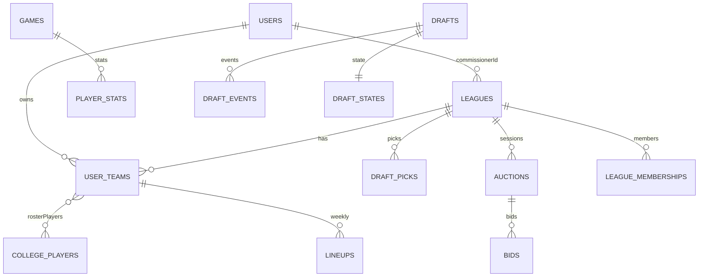

# System Map (Features, Routes, Collections)

## Collections (from SSOT: `schema/zod-schema.ts`)

- leagues: required → `name`, `commissioner`, `season`, `maxTeams`, `draftType`, `gameMode`
- user_teams: required → `leagueId`, `userId`, `teamName`
- college_players: required → `name`, `position`, `team`, `conference`
- games: required → `week`, `season`, `season_type`, `home_team`, `away_team`, `start_date`
- rankings: required → `week`, `season`, `poll_type`, `team`, `rank`
- lineups: required → `rosterId`, `week`, `season`
- auctions: required → `leagueId`
- bids: required → `auctionId`, `playerId`, `bidderId`, `amount`
- player_stats: required → `playerId`, `gameId`, `week`, `season`, `stats`
- users: required → `email`
- activity_log: required → `action`

Gaps (not in SSOT yet, but used): `draft_picks`, `mock_drafts`, `mock_draft_picks`, `mock_draft_participants`.

## Feature → Routes → Collections (high-level)

- Auth: signup/login/logout/profile → `users`
- Create League → `leagues`, `user_teams`
- League Details/My Leagues → `leagues`, `user_teams`, `users`
- Locker Room → `leagues`, `user_teams`, `college_players`, `users`
- Roster Detail/Lineup → `user_teams`
- Draft Status/Pick → `leagues`, `draft_picks`, `user_teams`, `activity_log`
- Players (Enhanced) → `college_players`
- Projections → `projections_yearly`, `projections_weekly` (db), `college_players` (calc)
- Games/Rankings → `games`, `rankings`
- Conferences → `teams`
- Weekly Scoring → `games`, `player_stats`, updates `lineups` and `user_teams`
- Admin (Dedupe/Refresh/Retire) → `college_players`

## Simplification/Alignment Checklist

- Define missing collections in SSOT: `draft_picks`, `mock_*`.
- Ensure docs say `user_teams` (not `rosters`) except when referring to legacy.
- Enforce Appwrite rule: required attributes must not have defaults; if defaults needed → make optional and set in code.
- Keep route shape normalized to camelCase fields.
