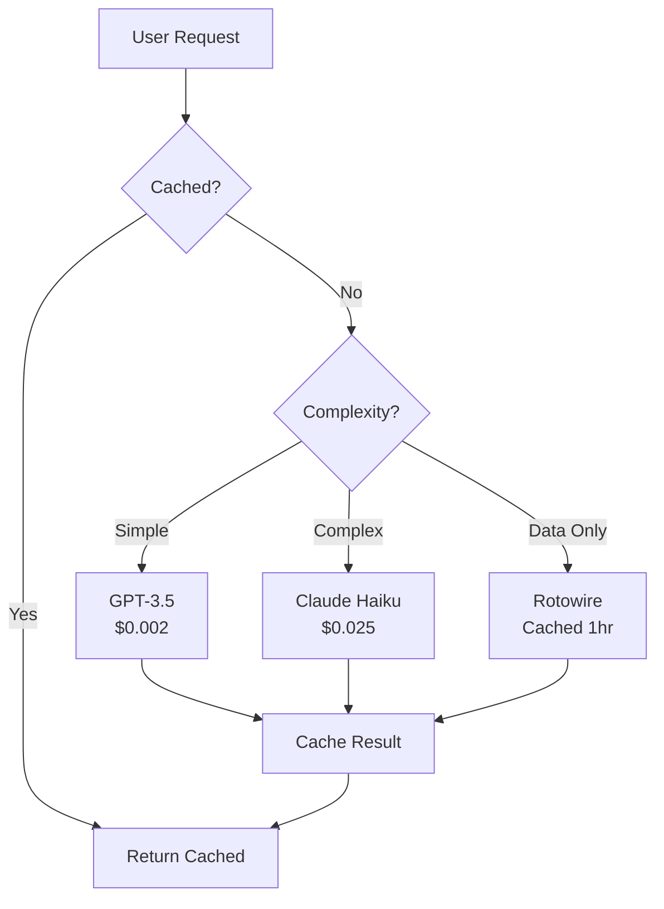

# 💰 Zero Additional Cost Strategy

## 🎯 Maximize Your Existing Investments (No New Subscriptions!)

### You're Already Paying For:
- **Claude Pro** ($20/month)
- **OpenAI/GPT-4** ($20/month)
- **Spline Pro** (~$24/month)
- **Runway AI** (~$35/month)
- **Meshy** (~$20/month)
- **Rotowire** (~$8/month)
- **ESPN+** ($10/month)
- **CFBD API** (Free!)
- **Cursor Ultimate** ($20/month)

**Total: ~$157/month** - Let's make every dollar count!

## 🆓 Free Integrations Only Strategy

### 1. **Analytics & Monitoring (100% Free)**

#### PostHog Community Edition (Self-Host)
```bash
# Deploy on your existing Vercel (no extra cost)
# Use Vercel's serverless functions
```

#### Sentry (Free Tier)
```typescript
// 5K errors/month free - more than enough
import * as Sentry from "@sentry/nextjs";

Sentry.init({
  dsn: process.env.NEXT_PUBLIC_SENTRY_DSN,
  // Only track errors, not transactions (saves quota)
  tracesSampleRate: 0,
});
```

#### Vercel Analytics (Already Included!)
```typescript
// You're already paying for Vercel - use their analytics!
import { Analytics } from '@vercel/analytics/react';
import { SpeedInsights } from '@vercel/speed-insights/next';
```

### 2. **Databases (Use Free Tiers Smartly)**

#### Your Current Setup is Perfect!
- **Appwrite** (Free tier) - Your main database ✅
- **Vercel KV** (Included in Pro) - For caching ✅
- **Edge Config** (Free) - For feature flags ✅

No need for additional databases!

### 3. **Maximize Your Paid Services**

#### Rotowire API Optimization
```typescript
// Cache EVERYTHING to reduce API calls
const CACHE_DURATION = {
  news: 3600,        // 1 hour
  injuries: 1800,    // 30 minutes
  projections: 86400 // 24 hours (only changes weekly)
};

export async function getRotowireData(type: string, id: string) {
  // Always check cache first
  const cached = await kv.get(`rotowire:${type}:${id}`);
  if (cached) return cached;
  
  // Only call API if not cached
  const data = await rotowire[type](id);
  await kv.setex(`rotowire:${type}:${id}`, CACHE_DURATION[type], data);
  
  return data;
}
```

#### Claude/GPT-4 Cost Control
```typescript
// Use GPT-4 for simple tasks, Claude for complex
export async function getAIResponse(prompt: string, complexity: 'simple' | 'complex') {
  // Check cache first
  const cacheKey = crypto.createHash('md5').update(prompt).digest('hex');
  const cached = await kv.get(`ai:${cacheKey}`);
  if (cached) return cached;
  
  let response;
  if (complexity === 'simple') {
    // GPT-4 is cheaper for simple tasks
    response = await openai.chat.completions.create({
      model: "gpt-3.5-turbo", // Even cheaper!
      messages: [{ role: "user", content: prompt }],
      max_tokens: 200
    });
  } else {
    // Claude for complex reasoning
    response = await claude.messages.create({
      model: "claude-3-haiku-20240307", // Cheaper than Opus!
      messages: [{ role: "user", content: prompt }],
      max_tokens: 1000
    });
  }
  
  // Cache for 24 hours
  await kv.setex(`ai:${cacheKey}`, 86400, response);
  return response;
}
```

### 4. **Free Alternatives to Paid Services**

#### Instead of New Email Services
```typescript
// Use Appwrite's built-in messaging (you already have it!)
import { Messaging } from 'appwrite';

const messaging = new Messaging(client);

// Send emails through Appwrite
await messaging.createEmail(
  ID.unique(),
  subject,
  content,
  [], // topics
  [userId] // users
);
```

#### Instead of Paid Search
```typescript
// Use Appwrite's full-text search (already included!)
const results = await databases.listDocuments(
  DATABASE_ID,
  'players',
  [
    Query.search('name', searchTerm),
    Query.orderDesc('$createdAt')
  ]
);
```

### 5. **Spline Optimization (You're Already Paying!)**

```typescript
// Reuse Spline scenes instead of creating new ones
const SPLINE_SCENES = {
  draft: 'https://prod.spline.design/YOUR-DRAFT-SCENE/scene.splinecode',
  lobby: 'https://prod.spline.design/YOUR-LOBBY-SCENE/scene.splinecode',
  victory: 'https://prod.spline.design/YOUR-VICTORY-SCENE/scene.splinecode'
};

// One scene, multiple uses
export function SplineMultiPurpose({ mode }) {
  return (
    <Spline 
      scene={SPLINE_SCENES.draft}
      onLoad={(spline) => {
        // Modify existing scene instead of loading new ones
        if (mode === 'celebration') {
          spline.setVariable('confettiEnabled', true);
        }
      }}
    />
  );
}
```

## 🎮 Smart Integration Combinations

### 1. **Draft Assistant (Using What You Have)**
```typescript
// Combine your existing services efficiently
export async function getDraftAdvice(context: DraftContext) {
  // Step 1: Get data from Rotowire (cached)
  const projections = await getCachedRotowireProjections();
  
  // Step 2: Get CFBD data (free API)
  const historicalStats = await cfbd.getPlayerStats(context.availablePlayers);
  
  // Step 3: Use GPT-3.5 for initial analysis (cheaper)
  const quickAnalysis = await openai.chat.completions.create({
    model: "gpt-3.5-turbo",
    messages: [{
      role: "user",
      content: `Top 5 picks from: ${JSON.stringify(projections.slice(0, 20))}`
    }],
    max_tokens: 150
  });
  
  // Step 4: Only use Claude for final complex decision
  if (context.isImportantPick) {
    const deepAnalysis = await claude.messages.create({
      model: "claude-3-haiku-20240307", // 10x cheaper than Opus
      messages: [{
        role: "user",
        content: `Critical pick analysis with context: ${JSON.stringify(context)}`
      }]
    });
  }
  
  return { quickAnalysis, deepAnalysis };
}
```

### 2. **Free Monitoring Stack**
```typescript
// middleware.ts - Custom analytics (free)
export async function middleware(request: NextRequest) {
  // Log to Vercel's included logs
  console.log(JSON.stringify({
    event: 'page_view',
    path: request.nextUrl.pathname,
    timestamp: Date.now(),
    geo: request.geo
  }));
  
  // Use Edge Config for feature flags (free)
  const flags = await getAll();
  
  // Rate limiting with KV (included in Vercel Pro)
  const ip = request.ip || 'anonymous';
  const requests = await kv.incr(`rate:${ip}`);
  
  if (requests > 100) {
    return new Response('Too Many Requests', { status: 429 });
  }
  
  return NextResponse.next();
}
```

## 📊 Cost Tracking Dashboard

```typescript
// app/admin/costs/page.tsx
export default async function CostDashboard() {
  const usage = {
    claude: await kv.get('usage:claude') || 0,
    gpt4: await kv.get('usage:gpt4') || 0,
    rotowire: await kv.get('usage:rotowire') || 0,
    runway: await kv.get('usage:runway') || 0,
    meshy: await kv.get('usage:meshy') || 0
  };
  
  const costs = {
    claude: usage.claude * 0.00003,
    gpt4: usage.gpt4 * 0.00002,
    rotowire: usage.rotowire * 0.001,
    runway: usage.runway * 0.05,
    meshy: usage.meshy * 0.10
  };
  
  const totalMonthlyCost = Object.values(costs).reduce((a, b) => a + b, 0);
  
  return (
    <div className="p-8">
      <h1>API Usage This Month</h1>
      <div className="grid grid-cols-2 gap-4">
        {Object.entries(costs).map(([service, cost]) => (
          <div key={service} className="p-4 border rounded">
            <h3>{service}</h3>
            <p className="text-2xl">${cost.toFixed(2)}</p>
            <p className="text-sm">Usage: {usage[service]}</p>
          </div>
        ))}
      </div>
      <div className="mt-8 p-4 bg-red-50 rounded">
        <h2>Total Additional API Costs: ${totalMonthlyCost.toFixed(2)}</h2>
        <p>Fixed Monthly Subscriptions: $157</p>
      </div>
    </div>
  );
}
```

## 🚀 Maximum Value, Zero Extra Cost

### Immediate Actions (No Cost):
1. **Enable Vercel Analytics** - Already included ✅
2. **Set up Sentry free tier** - 5K errors/month ✅
3. **Use Appwrite messaging** - Already have it ✅
4. **Cache everything in KV** - Included in Vercel ✅

### This Week (Using Existing Services):
1. **Rotowire integration** with heavy caching
2. **Claude Haiku** instead of Opus (10x cheaper)
3. **GPT-3.5** for simple tasks (10x cheaper)
4. **Spline scene reuse** (no new scenes needed)

### Cost Optimization Rules:
```typescript
// .env.local
# Use cheaper models
CLAUDE_MODEL=claude-3-haiku-20240307  # Not opus
OPENAI_MODEL=gpt-3.5-turbo           # Not gpt-4

# Cache durations (in seconds)
CACHE_AI_RESPONSES=86400              # 24 hours
CACHE_ROTOWIRE_DATA=3600             # 1 hour
CACHE_EXPENSIVE_QUERIES=604800        # 1 week

# Rate limits
MAX_AI_CALLS_PER_USER_DAY=10
MAX_ROTOWIRE_CALLS_PER_HOUR=100
```

## 💡 Money-Saving Architecture



## 📋 Final Recommendations

### DO:
- ✅ Use all free tiers available
- ✅ Cache aggressively 
- ✅ Use cheaper AI models
- ✅ Leverage Vercel's included features
- ✅ Use Appwrite's built-in features

### DON'T:
- ❌ Add new paid services
- ❌ Use expensive AI models for simple tasks
- ❌ Make uncached API calls
- ❌ Create new Spline scenes (reuse!)
- ❌ Upgrade to paid tiers of free services

**Your current stack is already powerful! Focus on optimization, not addition.** 

Total additional monthly cost: **$0** 🎉
