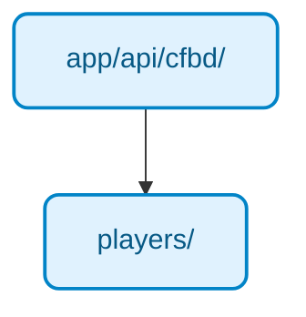

# Project Map — app/api/cfbd

```mermaid
flowchart TB
  classDef folder fill:#e0f2fe,stroke:#0284c7,stroke-width:2,color:#075985,rx:8,ry:8
  classDef file fill:#f0f9ff,stroke:#64748b,stroke-width:1,color:#334155,rx:4,ry:4
  app_api_cfbd["app/api/cfbd/" ]
  class app_api_cfbd folder
  app_api_cfbd_players["players/"]
  class app_api_cfbd_players folder
  app_api_cfbd --> app_api_cfbd_players
```
