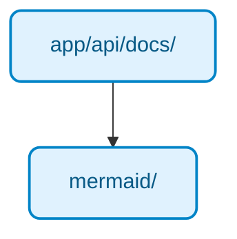

# Project Map — app/api/docs

```mermaid
flowchart TB
  classDef folder fill:#e0f2fe,stroke:#0284c7,stroke-width:2,color:#075985,rx:8,ry:8
  classDef file fill:#f0f9ff,stroke:#64748b,stroke-width:1,color:#334155,rx:4,ry:4
  app_api_docs["app/api/docs/" ]
  class app_api_docs folder
  app_api_docs_mermaid["mermaid/"]
  class app_api_docs_mermaid folder
  app_api_docs --> app_api_docs_mermaid
```
