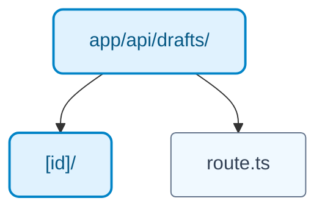

# Project Map — app/api/drafts

```mermaid
flowchart TB
  classDef folder fill:#e0f2fe,stroke:#0284c7,stroke-width:2,color:#075985,rx:8,ry:8
  classDef file fill:#f0f9ff,stroke:#64748b,stroke-width:1,color:#334155,rx:4,ry:4
  app_api_drafts["app/api/drafts/" ]
  class app_api_drafts folder
  app_api_drafts__id_["[id]/"]
  class app_api_drafts__id_ folder
  app_api_drafts --> app_api_drafts__id_
  app_api_drafts_route_ts["route.ts"]
  class app_api_drafts_route_ts file
  app_api_drafts --> app_api_drafts_route_ts
```
