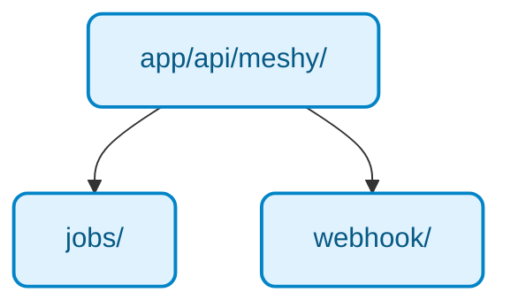

# Project Map — app/api/meshy

```mermaid
flowchart TB
  classDef folder fill:#e0f2fe,stroke:#0284c7,stroke-width:2,color:#075985,rx:8,ry:8
  classDef file fill:#f0f9ff,stroke:#64748b,stroke-width:1,color:#334155,rx:4,ry:4
  app_api_meshy["app/api/meshy/" ]
  class app_api_meshy folder
  app_api_meshy_jobs["jobs/"]
  class app_api_meshy_jobs folder
  app_api_meshy --> app_api_meshy_jobs
  app_api_meshy_webhook["webhook/"]
  class app_api_meshy_webhook folder
  app_api_meshy --> app_api_meshy_webhook
```
