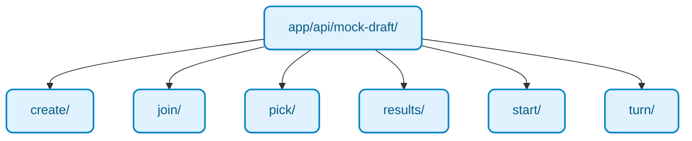

# Project Map — app/api/mock-draft

```mermaid
flowchart TB
  classDef folder fill:#e0f2fe,stroke:#0284c7,stroke-width:2,color:#075985,rx:8,ry:8
  classDef file fill:#f0f9ff,stroke:#64748b,stroke-width:1,color:#334155,rx:4,ry:4
  app_api_mock_draft["app/api/mock-draft/" ]
  class app_api_mock_draft folder
  app_api_mock_draft_create["create/"]
  class app_api_mock_draft_create folder
  app_api_mock_draft --> app_api_mock_draft_create
  app_api_mock_draft_join["join/"]
  class app_api_mock_draft_join folder
  app_api_mock_draft --> app_api_mock_draft_join
  app_api_mock_draft_pick["pick/"]
  class app_api_mock_draft_pick folder
  app_api_mock_draft --> app_api_mock_draft_pick
  app_api_mock_draft_results["results/"]
  class app_api_mock_draft_results folder
  app_api_mock_draft --> app_api_mock_draft_results
  app_api_mock_draft_start["start/"]
  class app_api_mock_draft_start folder
  app_api_mock_draft --> app_api_mock_draft_start
  app_api_mock_draft_turn["turn/"]
  class app_api_mock_draft_turn folder
  app_api_mock_draft --> app_api_mock_draft_turn
```
