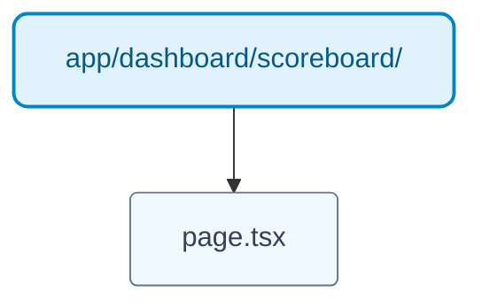

# Project Map — app/dashboard/scoreboard

```mermaid
flowchart TB
  classDef folder fill:#e0f2fe,stroke:#0284c7,stroke-width:2,color:#075985,rx:8,ry:8
  classDef file fill:#f0f9ff,stroke:#64748b,stroke-width:1,color:#334155,rx:4,ry:4
  app_dashboard_scoreboard["app/dashboard/scoreboard/" ]
  class app_dashboard_scoreboard folder
  app_dashboard_scoreboard_page_tsx["page.tsx"]
  class app_dashboard_scoreboard_page_tsx file
  app_dashboard_scoreboard --> app_dashboard_scoreboard_page_tsx
```
