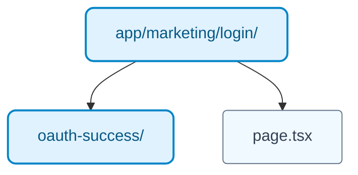

# Project Map — app/marketing/login

```mermaid
flowchart TB
  classDef folder fill:#e0f2fe,stroke:#0284c7,stroke-width:2,color:#075985,rx:8,ry:8
  classDef file fill:#f0f9ff,stroke:#64748b,stroke-width:1,color:#334155,rx:4,ry:4
  app_marketing_login["app/marketing/login/" ]
  class app_marketing_login folder
  app_marketing_login_oauth_success["oauth-success/"]
  class app_marketing_login_oauth_success folder
  app_marketing_login --> app_marketing_login_oauth_success
  app_marketing_login_page_tsx["page.tsx"]
  class app_marketing_login_page_tsx file
  app_marketing_login --> app_marketing_login_page_tsx
```
