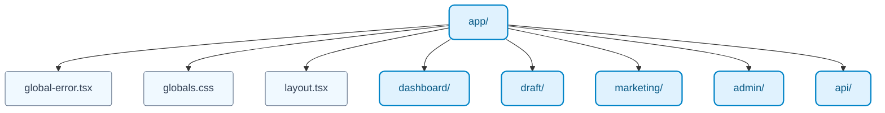

# Project Map — app

```mermaid
flowchart TB
  classDef folder fill:#e0f2fe,stroke:#0284c7,stroke-width:2,color:#075985,rx:8,ry:8
  classDef file fill:#f0f9ff,stroke:#64748b,stroke-width:1,color:#334155,rx:4,ry:4
  R["app/"]
  class R folder
  global_error_tsx["global-error.tsx"]
  class global_error_tsx file
  R --> global_error_tsx
  globals_css["globals.css"]
  class globals_css file
  R --> globals_css
  layout_tsx["layout.tsx"]
  class layout_tsx file
  R --> layout_tsx
  app_dashboard_["dashboard/"]
  class app_dashboard_ folder
  R --> app_dashboard_
  click app_dashboard_ "/admin/project-map/app/dashboard" "Open dashboard"
  app_draft_["draft/"]
  class app_draft_ folder
  R --> app_draft_
  click app_draft_ "/admin/project-map/app/draft" "Open draft"
  app_marketing_["marketing/"]
  class app_marketing_ folder
  R --> app_marketing_
  click app_marketing_ "/admin/project-map/app/marketing" "Open marketing"
  app_admin_["admin/"]
  class app_admin_ folder
  R --> app_admin_
  click app_admin_ "/admin/project-map/app/admin" "Open admin"
  app_api_["api/"]
  class app_api_ folder
  R --> app_api_
  click app_api_ "/admin/project-map/app/api" "Open api"
```
