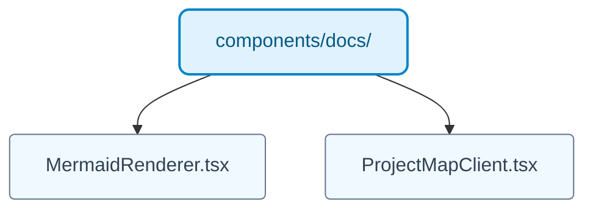

# Project Map — components/docs

```mermaid
flowchart TB
  classDef folder fill:#e0f2fe,stroke:#0284c7,stroke-width:2,color:#075985,rx:8,ry:8
  classDef file fill:#f0f9ff,stroke:#64748b,stroke-width:1,color:#334155,rx:4,ry:4
  components_docs["components/docs/" ]
  class components_docs folder
  components_docs_MermaidRenderer_tsx["MermaidRenderer.tsx"]
  class components_docs_MermaidRenderer_tsx file
  components_docs --> components_docs_MermaidRenderer_tsx
  components_docs_ProjectMapClient_tsx["ProjectMapClient.tsx"]
  class components_docs_ProjectMapClient_tsx file
  components_docs --> components_docs_ProjectMapClient_tsx
```
