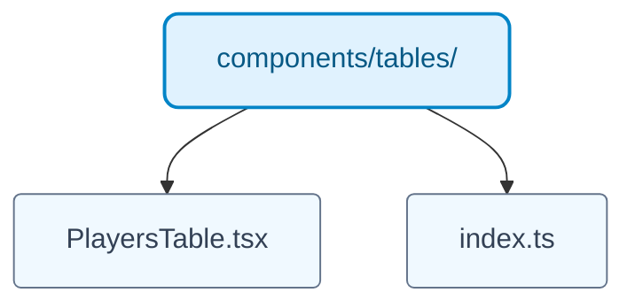

# Project Map — components/tables

```mermaid
flowchart TB
  classDef folder fill:#e0f2fe,stroke:#0284c7,stroke-width:2,color:#075985,rx:8,ry:8
  classDef file fill:#f0f9ff,stroke:#64748b,stroke-width:1,color:#334155,rx:4,ry:4
  components_tables["components/tables/" ]
  class components_tables folder
  components_tables_PlayersTable_tsx["PlayersTable.tsx"]
  class components_tables_PlayersTable_tsx file
  components_tables --> components_tables_PlayersTable_tsx
  components_tables_index_ts["index.ts"]
  class components_tables_index_ts file
  components_tables --> components_tables_index_ts
```
