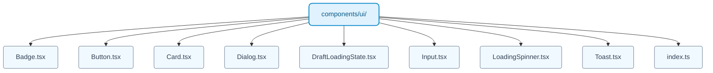

# Project Map — components/ui

```mermaid
flowchart TB
  classDef folder fill:#e0f2fe,stroke:#0284c7,stroke-width:2,color:#075985,rx:8,ry:8
  classDef file fill:#f0f9ff,stroke:#64748b,stroke-width:1,color:#334155,rx:4,ry:4
  components_ui["components/ui/" ]
  class components_ui folder
  components_ui_Badge_tsx["Badge.tsx"]
  class components_ui_Badge_tsx file
  components_ui --> components_ui_Badge_tsx
  components_ui_Button_tsx["Button.tsx"]
  class components_ui_Button_tsx file
  components_ui --> components_ui_Button_tsx
  components_ui_Card_tsx["Card.tsx"]
  class components_ui_Card_tsx file
  components_ui --> components_ui_Card_tsx
  components_ui_Dialog_tsx["Dialog.tsx"]
  class components_ui_Dialog_tsx file
  components_ui --> components_ui_Dialog_tsx
  components_ui_DraftLoadingState_tsx["DraftLoadingState.tsx"]
  class components_ui_DraftLoadingState_tsx file
  components_ui --> components_ui_DraftLoadingState_tsx
  components_ui_Input_tsx["Input.tsx"]
  class components_ui_Input_tsx file
  components_ui --> components_ui_Input_tsx
  components_ui_LoadingSpinner_tsx["LoadingSpinner.tsx"]
  class components_ui_LoadingSpinner_tsx file
  components_ui --> components_ui_LoadingSpinner_tsx
  components_ui_Toast_tsx["Toast.tsx"]
  class components_ui_Toast_tsx file
  components_ui --> components_ui_Toast_tsx
  components_ui_index_ts["index.ts"]
  class components_ui_index_ts file
  components_ui --> components_ui_index_ts
```
