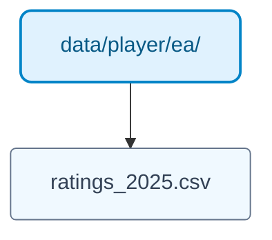

# Project Map — data/player/ea

```mermaid
flowchart TB
  classDef folder fill:#e0f2fe,stroke:#0284c7,stroke-width:2,color:#075985,rx:8,ry:8
  classDef file fill:#f0f9ff,stroke:#64748b,stroke-width:1,color:#334155,rx:4,ry:4
  data_player_ea["data/player/ea/" ]
  class data_player_ea folder
  data_player_ea_ratings_2025_csv["ratings_2025.csv"]
  class data_player_ea_ratings_2025_csv file
  data_player_ea --> data_player_ea_ratings_2025_csv
```
