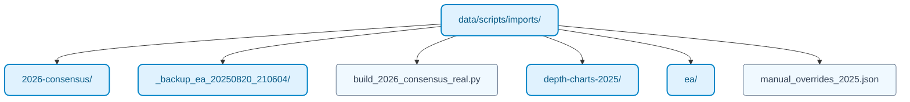

# Project Map — data/scripts/imports

```mermaid
flowchart TB
  classDef folder fill:#e0f2fe,stroke:#0284c7,stroke-width:2,color:#075985,rx:8,ry:8
  classDef file fill:#f0f9ff,stroke:#64748b,stroke-width:1,color:#334155,rx:4,ry:4
  data_scripts_imports["data/scripts/imports/" ]
  class data_scripts_imports folder
  data_scripts_imports_2026_consensus["2026-consensus/"]
  class data_scripts_imports_2026_consensus folder
  data_scripts_imports --> data_scripts_imports_2026_consensus
  data_scripts_imports__backup_ea_20250820_210604["_backup_ea_20250820_210604/"]
  class data_scripts_imports__backup_ea_20250820_210604 folder
  data_scripts_imports --> data_scripts_imports__backup_ea_20250820_210604
  data_scripts_imports_build_2026_consensus_real_py["build_2026_consensus_real.py"]
  class data_scripts_imports_build_2026_consensus_real_py file
  data_scripts_imports --> data_scripts_imports_build_2026_consensus_real_py
  data_scripts_imports_depth_charts_2025["depth-charts-2025/"]
  class data_scripts_imports_depth_charts_2025 folder
  data_scripts_imports --> data_scripts_imports_depth_charts_2025
  data_scripts_imports_ea["ea/"]
  class data_scripts_imports_ea folder
  data_scripts_imports --> data_scripts_imports_ea
  data_scripts_imports_manual_overrides_2025_json["manual_overrides_2025.json"]
  class data_scripts_imports_manual_overrides_2025_json file
  data_scripts_imports --> data_scripts_imports_manual_overrides_2025_json
```
