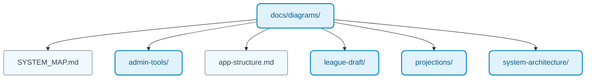

# Project Map — docs/diagrams

```mermaid
flowchart TB
  classDef folder fill:#e0f2fe,stroke:#0284c7,stroke-width:2,color:#075985,rx:8,ry:8
  classDef file fill:#f0f9ff,stroke:#64748b,stroke-width:1,color:#334155,rx:4,ry:4
  docs_diagrams["docs/diagrams/" ]
  class docs_diagrams folder
  docs_diagrams_SYSTEM_MAP_md["SYSTEM_MAP.md"]
  class docs_diagrams_SYSTEM_MAP_md file
  docs_diagrams --> docs_diagrams_SYSTEM_MAP_md
  docs_diagrams_admin_tools["admin-tools/"]
  class docs_diagrams_admin_tools folder
  docs_diagrams --> docs_diagrams_admin_tools
  click docs_diagrams_admin_tools "/admin/project-map/docs/diagrams/admin-tools" "Open admin-tools"
  docs_diagrams_app_structure_md["app-structure.md"]
  class docs_diagrams_app_structure_md file
  docs_diagrams --> docs_diagrams_app_structure_md
  docs_diagrams_league_draft["league-draft/"]
  class docs_diagrams_league_draft folder
  docs_diagrams --> docs_diagrams_league_draft
  click docs_diagrams_league_draft "/admin/project-map/docs/diagrams/league-draft" "Open league-draft"
  docs_diagrams_projections["projections/"]
  class docs_diagrams_projections folder
  docs_diagrams --> docs_diagrams_projections
  click docs_diagrams_projections "/admin/project-map/docs/diagrams/projections" "Open projections"
  docs_diagrams_system_architecture["system-architecture/"]
  class docs_diagrams_system_architecture folder
  docs_diagrams --> docs_diagrams_system_architecture
  click docs_diagrams_system_architecture "/admin/project-map/docs/diagrams/system-architecture" "Open system-architecture"
```
