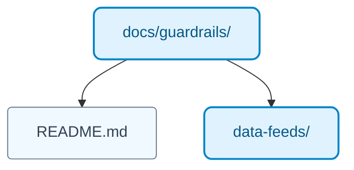

# Project Map — docs/guardrails

```mermaid
flowchart TB
  classDef folder fill:#e0f2fe,stroke:#0284c7,stroke-width:2,color:#075985,rx:8,ry:8
  classDef file fill:#f0f9ff,stroke:#64748b,stroke-width:1,color:#334155,rx:4,ry:4
  docs_guardrails["docs/guardrails/" ]
  class docs_guardrails folder
  docs_guardrails_README_md["README.md"]
  class docs_guardrails_README_md file
  docs_guardrails --> docs_guardrails_README_md
  docs_guardrails_data_feeds["data-feeds/"]
  class docs_guardrails_data_feeds folder
  docs_guardrails --> docs_guardrails_data_feeds
  click docs_guardrails_data_feeds "/admin/project-map/docs/guardrails/data-feeds" "Open data-feeds"
```
