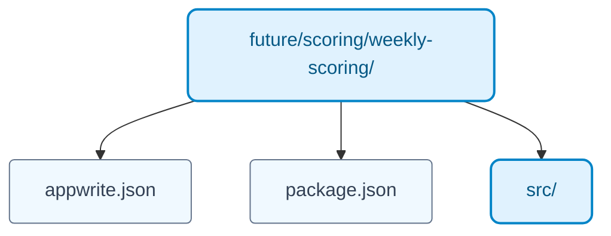

# Project Map — future/scoring/weekly-scoring

```mermaid
flowchart TB
  classDef folder fill:#e0f2fe,stroke:#0284c7,stroke-width:2,color:#075985,rx:8,ry:8
  classDef file fill:#f0f9ff,stroke:#64748b,stroke-width:1,color:#334155,rx:4,ry:4
  future_scoring_weekly_scoring["future/scoring/weekly-scoring/" ]
  class future_scoring_weekly_scoring folder
  future_scoring_weekly_scoring_appwrite_json["appwrite.json"]
  class future_scoring_weekly_scoring_appwrite_json file
  future_scoring_weekly_scoring --> future_scoring_weekly_scoring_appwrite_json
  future_scoring_weekly_scoring_package_json["package.json"]
  class future_scoring_weekly_scoring_package_json file
  future_scoring_weekly_scoring --> future_scoring_weekly_scoring_package_json
  future_scoring_weekly_scoring_src["src/"]
  class future_scoring_weekly_scoring_src folder
  future_scoring_weekly_scoring --> future_scoring_weekly_scoring_src
```
