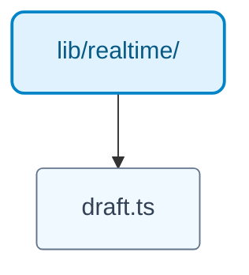

# Project Map — lib/realtime

```mermaid
flowchart TB
  classDef folder fill:#e0f2fe,stroke:#0284c7,stroke-width:2,color:#075985,rx:8,ry:8
  classDef file fill:#f0f9ff,stroke:#64748b,stroke-width:1,color:#334155,rx:4,ry:4
  lib_realtime["lib/realtime/" ]
  class lib_realtime folder
  lib_realtime_draft_ts["draft.ts"]
  class lib_realtime_draft_ts file
  lib_realtime --> lib_realtime_draft_ts
```
