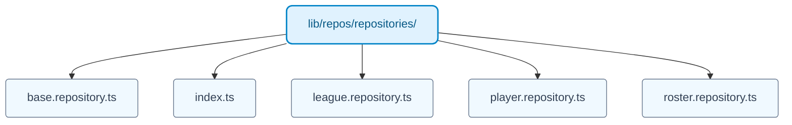

# Project Map — lib/repos/repositories

```mermaid
flowchart TB
  classDef folder fill:#e0f2fe,stroke:#0284c7,stroke-width:2,color:#075985,rx:8,ry:8
  classDef file fill:#f0f9ff,stroke:#64748b,stroke-width:1,color:#334155,rx:4,ry:4
  lib_repos_repositories["lib/repos/repositories/" ]
  class lib_repos_repositories folder
  lib_repos_repositories_base_repository_ts["base.repository.ts"]
  class lib_repos_repositories_base_repository_ts file
  lib_repos_repositories --> lib_repos_repositories_base_repository_ts
  lib_repos_repositories_index_ts["index.ts"]
  class lib_repos_repositories_index_ts file
  lib_repos_repositories --> lib_repos_repositories_index_ts
  lib_repos_repositories_league_repository_ts["league.repository.ts"]
  class lib_repos_repositories_league_repository_ts file
  lib_repos_repositories --> lib_repos_repositories_league_repository_ts
  lib_repos_repositories_player_repository_ts["player.repository.ts"]
  class lib_repos_repositories_player_repository_ts file
  lib_repos_repositories --> lib_repos_repositories_player_repository_ts
  lib_repos_repositories_roster_repository_ts["roster.repository.ts"]
  class lib_repos_repositories_roster_repository_ts file
  lib_repos_repositories --> lib_repos_repositories_roster_repository_ts
```
