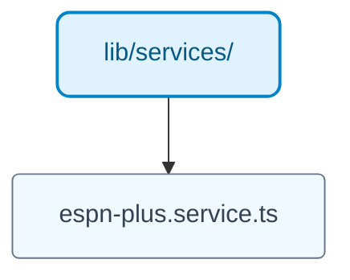

# Project Map — lib/services

```mermaid
flowchart TB
  classDef folder fill:#e0f2fe,stroke:#0284c7,stroke-width:2,color:#075985,rx:8,ry:8
  classDef file fill:#f0f9ff,stroke:#64748b,stroke-width:1,color:#334155,rx:4,ry:4
  lib_services["lib/services/" ]
  class lib_services folder
  lib_services_espn_plus_service_ts["espn-plus.service.ts"]
  class lib_services_espn_plus_service_ts file
  lib_services --> lib_services_espn_plus_service_ts
```
