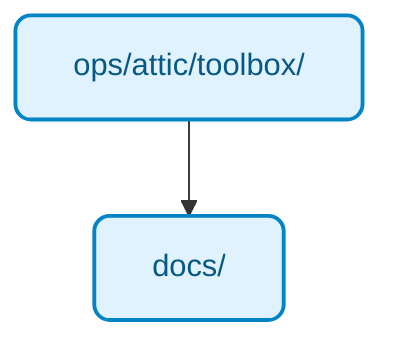

# Project Map — ops/attic/toolbox

```mermaid
flowchart TB
  classDef folder fill:#e0f2fe,stroke:#0284c7,stroke-width:2,color:#075985,rx:8,ry:8
  classDef file fill:#f0f9ff,stroke:#64748b,stroke-width:1,color:#334155,rx:4,ry:4
  ops_attic_toolbox["ops/attic/toolbox/" ]
  class ops_attic_toolbox folder
  ops_attic_toolbox_docs["docs/"]
  class ops_attic_toolbox_docs folder
  ops_attic_toolbox --> ops_attic_toolbox_docs
```
