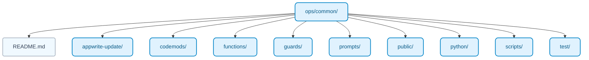

# Project Map — ops/common

```mermaid
flowchart TB
  classDef folder fill:#e0f2fe,stroke:#0284c7,stroke-width:2,color:#075985,rx:8,ry:8
  classDef file fill:#f0f9ff,stroke:#64748b,stroke-width:1,color:#334155,rx:4,ry:4
  ops_common["ops/common/" ]
  class ops_common folder
  ops_common_README_md["README.md"]
  class ops_common_README_md file
  ops_common --> ops_common_README_md
  ops_common_appwrite_update["appwrite-update/"]
  class ops_common_appwrite_update folder
  ops_common --> ops_common_appwrite_update
  click ops_common_appwrite_update "/admin/project-map/ops/common/appwrite-update" "Open appwrite-update"
  ops_common_codemods["codemods/"]
  class ops_common_codemods folder
  ops_common --> ops_common_codemods
  click ops_common_codemods "/admin/project-map/ops/common/codemods" "Open codemods"
  ops_common_functions["functions/"]
  class ops_common_functions folder
  ops_common --> ops_common_functions
  click ops_common_functions "/admin/project-map/ops/common/functions" "Open functions"
  ops_common_guards["guards/"]
  class ops_common_guards folder
  ops_common --> ops_common_guards
  click ops_common_guards "/admin/project-map/ops/common/guards" "Open guards"
  ops_common_prompts["prompts/"]
  class ops_common_prompts folder
  ops_common --> ops_common_prompts
  click ops_common_prompts "/admin/project-map/ops/common/prompts" "Open prompts"
  ops_common_public["public/"]
  class ops_common_public folder
  ops_common --> ops_common_public
  click ops_common_public "/admin/project-map/ops/common/public" "Open public"
  ops_common_python["python/"]
  class ops_common_python folder
  ops_common --> ops_common_python
  click ops_common_python "/admin/project-map/ops/common/python" "Open python"
  ops_common_scripts["scripts/"]
  class ops_common_scripts folder
  ops_common --> ops_common_scripts
  click ops_common_scripts "/admin/project-map/ops/common/scripts" "Open scripts"
  ops_common_test["test/"]
  class ops_common_test folder
  ops_common --> ops_common_test
  click ops_common_test "/admin/project-map/ops/common/test" "Open test"
```
