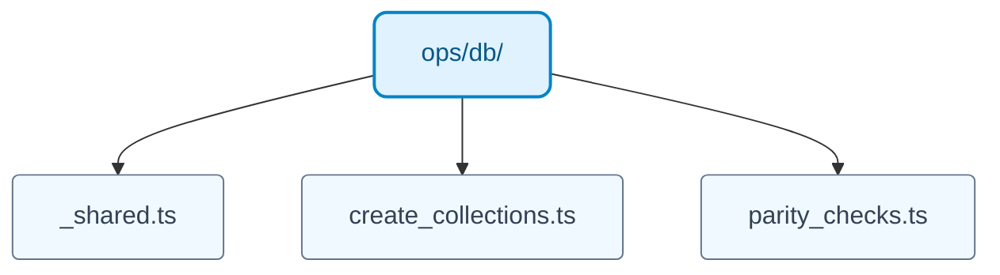

# Project Map — ops/db

```mermaid
flowchart TB
  classDef folder fill:#e0f2fe,stroke:#0284c7,stroke-width:2,color:#075985,rx:8,ry:8
  classDef file fill:#f0f9ff,stroke:#64748b,stroke-width:1,color:#334155,rx:4,ry:4
  ops_db["ops/db/" ]
  class ops_db folder
  ops_db__shared_ts["_shared.ts"]
  class ops_db__shared_ts file
  ops_db --> ops_db__shared_ts
  ops_db_create_collections_ts["create_collections.ts"]
  class ops_db_create_collections_ts file
  ops_db --> ops_db_create_collections_ts
  ops_db_parity_checks_ts["parity_checks.ts"]
  class ops_db_parity_checks_ts file
  ops_db --> ops_db_parity_checks_ts
```
