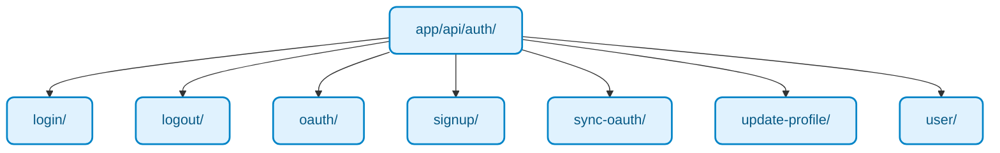

# Project Map — app/api/auth

```mermaid
flowchart TB
  classDef folder fill:#e0f2fe,stroke:#0284c7,stroke-width:2,color:#075985,rx:8,ry:8
  classDef file fill:#f0f9ff,stroke:#64748b,stroke-width:1,color:#334155,rx:4,ry:4
  app_api_auth["app/api/auth/" ]
  class app_api_auth folder
  app_api_auth_login["login/"]
  class app_api_auth_login folder
  app_api_auth --> app_api_auth_login
  app_api_auth_logout["logout/"]
  class app_api_auth_logout folder
  app_api_auth --> app_api_auth_logout
  app_api_auth_oauth["oauth/"]
  class app_api_auth_oauth folder
  app_api_auth --> app_api_auth_oauth
  app_api_auth_signup["signup/"]
  class app_api_auth_signup folder
  app_api_auth --> app_api_auth_signup
  app_api_auth_sync_oauth["sync-oauth/"]
  class app_api_auth_sync_oauth folder
  app_api_auth --> app_api_auth_sync_oauth
  app_api_auth_update_profile["update-profile/"]
  class app_api_auth_update_profile folder
  app_api_auth --> app_api_auth_update_profile
  app_api_auth_user["user/"]
  class app_api_auth_user folder
  app_api_auth --> app_api_auth_user
```
