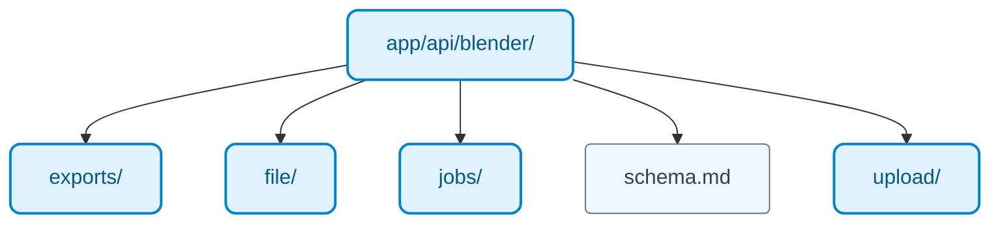

# Project Map — app/api/blender

```mermaid
flowchart TB
  classDef folder fill:#e0f2fe,stroke:#0284c7,stroke-width:2,color:#075985,rx:8,ry:8
  classDef file fill:#f0f9ff,stroke:#64748b,stroke-width:1,color:#334155,rx:4,ry:4
  app_api_blender["app/api/blender/" ]
  class app_api_blender folder
  app_api_blender_exports["exports/"]
  class app_api_blender_exports folder
  app_api_blender --> app_api_blender_exports
  app_api_blender_file["file/"]
  class app_api_blender_file folder
  app_api_blender --> app_api_blender_file
  app_api_blender_jobs["jobs/"]
  class app_api_blender_jobs folder
  app_api_blender --> app_api_blender_jobs
  app_api_blender_schema_md["schema.md"]
  class app_api_blender_schema_md file
  app_api_blender --> app_api_blender_schema_md
  app_api_blender_upload["upload/"]
  class app_api_blender_upload folder
  app_api_blender --> app_api_blender_upload
```
