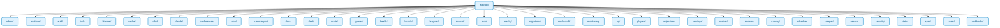

# Project Map — app/api

```mermaid
flowchart TB
  classDef folder fill:#e0f2fe,stroke:#0284c7,stroke-width:2,color:#075985,rx:8,ry:8
  classDef file fill:#f0f9ff,stroke:#64748b,stroke-width:1,color:#334155,rx:4,ry:4
  app_api["app/api/" ]
  class app_api folder
  app_api_admin["admin/"]
  class app_api_admin folder
  app_api --> app_api_admin
  click app_api_admin "/admin/project-map/app/api/admin" "Open admin"
  app_api_auctions["auctions/"]
  class app_api_auctions folder
  app_api --> app_api_auctions
  click app_api_auctions "/admin/project-map/app/api/auctions" "Open auctions"
  app_api_auth["auth/"]
  class app_api_auth folder
  app_api --> app_api_auth
  click app_api_auth "/admin/project-map/app/api/auth" "Open auth"
  app_api_bids["bids/"]
  class app_api_bids folder
  app_api --> app_api_bids
  click app_api_bids "/admin/project-map/app/api/bids" "Open bids"
  app_api_blender["blender/"]
  class app_api_blender folder
  app_api --> app_api_blender
  click app_api_blender "/admin/project-map/app/api/blender" "Open blender"
  app_api_cache["cache/"]
  class app_api_cache folder
  app_api --> app_api_cache
  click app_api_cache "/admin/project-map/app/api/cache" "Open cache"
  app_api_cfbd["cfbd/"]
  class app_api_cfbd folder
  app_api --> app_api_cfbd
  click app_api_cfbd "/admin/project-map/app/api/cfbd" "Open cfbd"
  app_api_claude["claude/"]
  class app_api_claude folder
  app_api --> app_api_claude
  click app_api_claude "/admin/project-map/app/api/claude" "Open claude"
  app_api_conferences["conferences/"]
  class app_api_conferences folder
  app_api --> app_api_conferences
  click app_api_conferences "/admin/project-map/app/api/conferences" "Open conferences"
  app_api_cron["cron/"]
  class app_api_cron folder
  app_api --> app_api_cron
  click app_api_cron "/admin/project-map/app/api/cron" "Open cron"
  app_api_cursor_report["cursor-report/"]
  class app_api_cursor_report folder
  app_api --> app_api_cursor_report
  click app_api_cursor_report "/admin/project-map/app/api/cursor-report" "Open cursor-report"
  app_api_docs["docs/"]
  class app_api_docs folder
  app_api --> app_api_docs
  click app_api_docs "/admin/project-map/app/api/docs" "Open docs"
  app_api_draft["draft/"]
  class app_api_draft folder
  app_api --> app_api_draft
  click app_api_draft "/admin/project-map/app/api/draft" "Open draft"
  app_api_drafts["drafts/"]
  class app_api_drafts folder
  app_api --> app_api_drafts
  click app_api_drafts "/admin/project-map/app/api/drafts" "Open drafts"
  app_api_games["games/"]
  class app_api_games folder
  app_api --> app_api_games
  click app_api_games "/admin/project-map/app/api/games" "Open games"
  app_api_health["health/"]
  class app_api_health folder
  app_api --> app_api_health
  click app_api_health "/admin/project-map/app/api/health" "Open health"
  app_api_launch["launch/"]
  class app_api_launch folder
  app_api --> app_api_launch
  click app_api_launch "/admin/project-map/app/api/launch" "Open launch"
  app_api_leagues["leagues/"]
  class app_api_leagues folder
  app_api --> app_api_leagues
  click app_api_leagues "/admin/project-map/app/api/leagues" "Open leagues"
  app_api_mascot["mascot/"]
  class app_api_mascot folder
  app_api --> app_api_mascot
  click app_api_mascot "/admin/project-map/app/api/mascot" "Open mascot"
  app_api_mcp["mcp/"]
  class app_api_mcp folder
  app_api --> app_api_mcp
  click app_api_mcp "/admin/project-map/app/api/mcp" "Open mcp"
  app_api_meshy["meshy/"]
  class app_api_meshy folder
  app_api --> app_api_meshy
  click app_api_meshy "/admin/project-map/app/api/meshy" "Open meshy"
  app_api_migrations["migrations/"]
  class app_api_migrations folder
  app_api --> app_api_migrations
  click app_api_migrations "/admin/project-map/app/api/migrations" "Open migrations"
  app_api_mock_draft["mock-draft/"]
  class app_api_mock_draft folder
  app_api --> app_api_mock_draft
  click app_api_mock_draft "/admin/project-map/app/api/mock-draft" "Open mock-draft"
  app_api_monitoring["monitoring/"]
  class app_api_monitoring folder
  app_api --> app_api_monitoring
  click app_api_monitoring "/admin/project-map/app/api/monitoring" "Open monitoring"
  app_api_og["og/"]
  class app_api_og folder
  app_api --> app_api_og
  click app_api_og "/admin/project-map/app/api/og" "Open og"
  app_api_players["players/"]
  class app_api_players folder
  app_api --> app_api_players
  click app_api_players "/admin/project-map/app/api/players" "Open players"
  app_api_projections["projections/"]
  class app_api_projections folder
  app_api --> app_api_projections
  click app_api_projections "/admin/project-map/app/api/projections" "Open projections"
  app_api_rankings["rankings/"]
  class app_api_rankings folder
  app_api --> app_api_rankings
  click app_api_rankings "/admin/project-map/app/api/rankings" "Open rankings"
  app_api_rosters["rosters/"]
  class app_api_rosters folder
  app_api --> app_api_rosters
  click app_api_rosters "/admin/project-map/app/api/rosters" "Open rosters"
  app_api_rotowire["rotowire/"]
  class app_api_rotowire folder
  app_api --> app_api_rotowire
  click app_api_rotowire "/admin/project-map/app/api/rotowire" "Open rotowire"
  app_api_runway["runway/"]
  class app_api_runway folder
  app_api --> app_api_runway
  click app_api_runway "/admin/project-map/app/api/runway" "Open runway"
  app_api_schedule["schedule/"]
  class app_api_schedule folder
  app_api --> app_api_schedule
  click app_api_schedule "/admin/project-map/app/api/schedule" "Open schedule"
  app_api_scraper["scraper/"]
  class app_api_scraper folder
  app_api --> app_api_scraper
  click app_api_scraper "/admin/project-map/app/api/scraper" "Open scraper"
  app_api_search["search/"]
  class app_api_search folder
  app_api --> app_api_search
  click app_api_search "/admin/project-map/app/api/search" "Open search"
  app_api_security["security/"]
  class app_api_security folder
  app_api --> app_api_security
  click app_api_security "/admin/project-map/app/api/security" "Open security"
  app_api_static["static/"]
  class app_api_static folder
  app_api --> app_api_static
  click app_api_static "/admin/project-map/app/api/static" "Open static"
  app_api_sync["sync/"]
  class app_api_sync folder
  app_api --> app_api_sync
  click app_api_sync "/admin/project-map/app/api/sync" "Open sync"
  app_api_users["users/"]
  class app_api_users folder
  app_api --> app_api_users
  click app_api_users "/admin/project-map/app/api/users" "Open users"
  app_api_webhooks["webhooks/"]
  class app_api_webhooks folder
  app_api --> app_api_webhooks
  click app_api_webhooks "/admin/project-map/app/api/webhooks" "Open webhooks"
```
