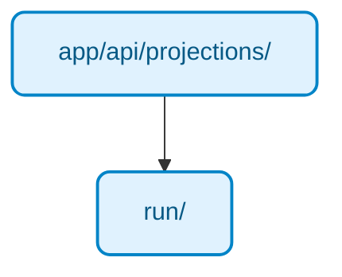

# Project Map — app/api/projections

```mermaid
flowchart TB
  classDef folder fill:#e0f2fe,stroke:#0284c7,stroke-width:2,color:#075985,rx:8,ry:8
  classDef file fill:#f0f9ff,stroke:#64748b,stroke-width:1,color:#334155,rx:4,ry:4
  app_api_projections["app/api/projections/" ]
  class app_api_projections folder
  app_api_projections_run["run/"]
  class app_api_projections_run folder
  app_api_projections --> app_api_projections_run
```
