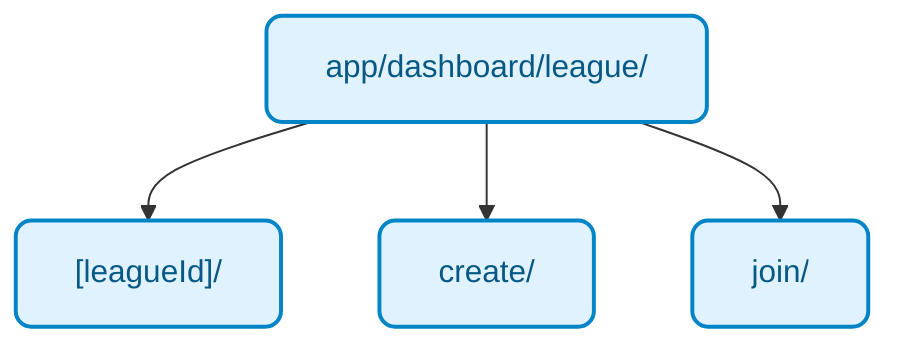

# Project Map — app/dashboard/league

```mermaid
flowchart TB
  classDef folder fill:#e0f2fe,stroke:#0284c7,stroke-width:2,color:#075985,rx:8,ry:8
  classDef file fill:#f0f9ff,stroke:#64748b,stroke-width:1,color:#334155,rx:4,ry:4
  app_dashboard_league["app/dashboard/league/" ]
  class app_dashboard_league folder
  app_dashboard_league__leagueId_["[leagueId]/"]
  class app_dashboard_league__leagueId_ folder
  app_dashboard_league --> app_dashboard_league__leagueId_
  app_dashboard_league_create["create/"]
  class app_dashboard_league_create folder
  app_dashboard_league --> app_dashboard_league_create
  app_dashboard_league_join["join/"]
  class app_dashboard_league_join folder
  app_dashboard_league --> app_dashboard_league_join
```
