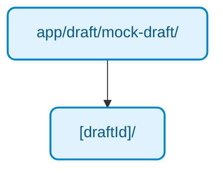

# Project Map — app/draft/mock-draft

```mermaid
flowchart TB
  classDef folder fill:#e0f2fe,stroke:#0284c7,stroke-width:2,color:#075985,rx:8,ry:8
  classDef file fill:#f0f9ff,stroke:#64748b,stroke-width:1,color:#334155,rx:4,ry:4
  app_draft_mock_draft["app/draft/mock-draft/" ]
  class app_draft_mock_draft folder
  app_draft_mock_draft__draftId_["[draftId]/"]
  class app_draft_mock_draft__draftId_ folder
  app_draft_mock_draft --> app_draft_mock_draft__draftId_
```
