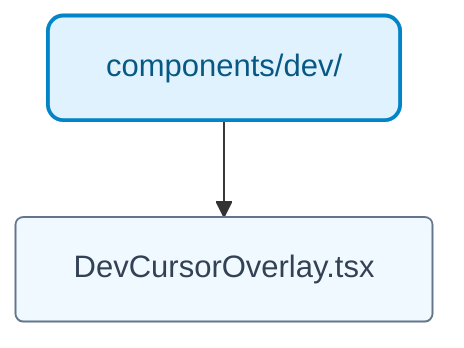

# Project Map — components/dev

```mermaid
flowchart TB
  classDef folder fill:#e0f2fe,stroke:#0284c7,stroke-width:2,color:#075985,rx:8,ry:8
  classDef file fill:#f0f9ff,stroke:#64748b,stroke-width:1,color:#334155,rx:4,ry:4
  components_dev["components/dev/" ]
  class components_dev folder
  components_dev_DevCursorOverlay_tsx["DevCursorOverlay.tsx"]
  class components_dev_DevCursorOverlay_tsx file
  components_dev --> components_dev_DevCursorOverlay_tsx
```
