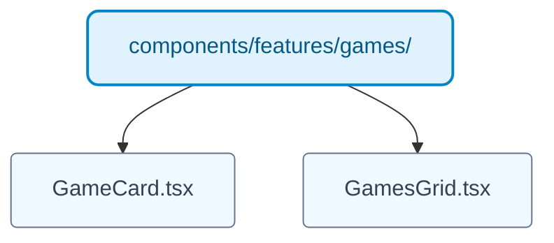

# Project Map — components/features/games

```mermaid
flowchart TB
  classDef folder fill:#e0f2fe,stroke:#0284c7,stroke-width:2,color:#075985,rx:8,ry:8
  classDef file fill:#f0f9ff,stroke:#64748b,stroke-width:1,color:#334155,rx:4,ry:4
  components_features_games["components/features/games/" ]
  class components_features_games folder
  components_features_games_GameCard_tsx["GameCard.tsx"]
  class components_features_games_GameCard_tsx file
  components_features_games --> components_features_games_GameCard_tsx
  components_features_games_GamesGrid_tsx["GamesGrid.tsx"]
  class components_features_games_GamesGrid_tsx file
  components_features_games --> components_features_games_GamesGrid_tsx
```
