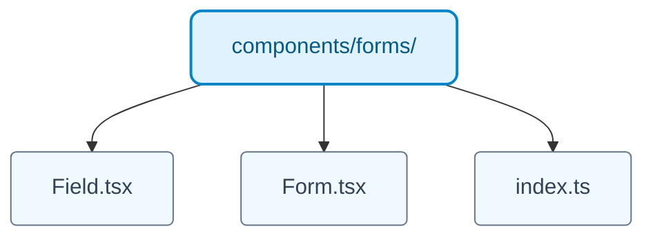

# Project Map — components/forms

```mermaid
flowchart TB
  classDef folder fill:#e0f2fe,stroke:#0284c7,stroke-width:2,color:#075985,rx:8,ry:8
  classDef file fill:#f0f9ff,stroke:#64748b,stroke-width:1,color:#334155,rx:4,ry:4
  components_forms["components/forms/" ]
  class components_forms folder
  components_forms_Field_tsx["Field.tsx"]
  class components_forms_Field_tsx file
  components_forms --> components_forms_Field_tsx
  components_forms_Form_tsx["Form.tsx"]
  class components_forms_Form_tsx file
  components_forms --> components_forms_Form_tsx
  components_forms_index_ts["index.ts"]
  class components_forms_index_ts file
  components_forms --> components_forms_index_ts
```
