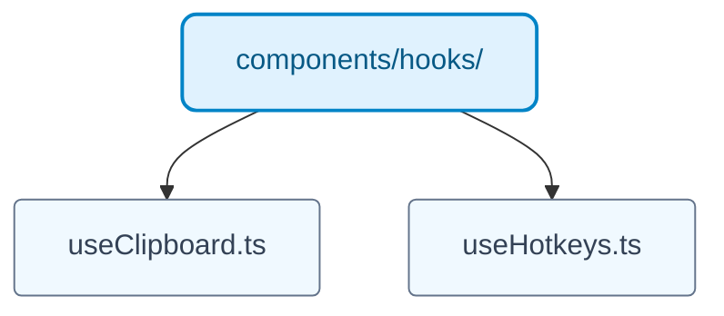

# Project Map — components/hooks

```mermaid
flowchart TB
  classDef folder fill:#e0f2fe,stroke:#0284c7,stroke-width:2,color:#075985,rx:8,ry:8
  classDef file fill:#f0f9ff,stroke:#64748b,stroke-width:1,color:#334155,rx:4,ry:4
  components_hooks["components/hooks/" ]
  class components_hooks folder
  components_hooks_useClipboard_ts["useClipboard.ts"]
  class components_hooks_useClipboard_ts file
  components_hooks --> components_hooks_useClipboard_ts
  components_hooks_useHotkeys_ts["useHotkeys.ts"]
  class components_hooks_useHotkeys_ts file
  components_hooks --> components_hooks_useHotkeys_ts
```
