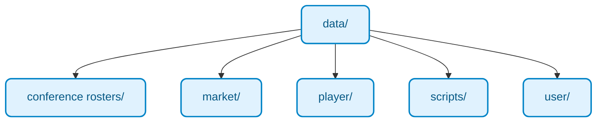

# Project Map — data

```mermaid
flowchart TB
  classDef folder fill:#e0f2fe,stroke:#0284c7,stroke-width:2,color:#075985,rx:8,ry:8
  classDef file fill:#f0f9ff,stroke:#64748b,stroke-width:1,color:#334155,rx:4,ry:4
  R["data/"]
  class R folder
  data_conference_rosters_["conference rosters/"]
  class data_conference_rosters_ folder
  R --> data_conference_rosters_
  click data_conference_rosters_ "/admin/project-map/data/conference rosters" "Open conference rosters"
  data_market_["market/"]
  class data_market_ folder
  R --> data_market_
  click data_market_ "/admin/project-map/data/market" "Open market"
  data_player_["player/"]
  class data_player_ folder
  R --> data_player_
  click data_player_ "/admin/project-map/data/player" "Open player"
  data_scripts_["scripts/"]
  class data_scripts_ folder
  R --> data_scripts_
  click data_scripts_ "/admin/project-map/data/scripts" "Open scripts"
  data_user_["user/"]
  class data_user_ folder
  R --> data_user_
  click data_user_ "/admin/project-map/data/user" "Open user"
```
