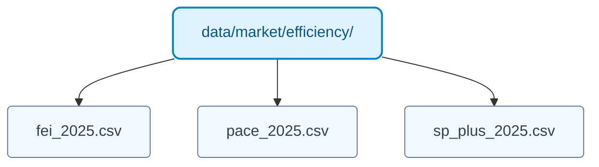

# Project Map — data/market/efficiency

```mermaid
flowchart TB
  classDef folder fill:#e0f2fe,stroke:#0284c7,stroke-width:2,color:#075985,rx:8,ry:8
  classDef file fill:#f0f9ff,stroke:#64748b,stroke-width:1,color:#334155,rx:4,ry:4
  data_market_efficiency["data/market/efficiency/" ]
  class data_market_efficiency folder
  data_market_efficiency_fei_2025_csv["fei_2025.csv"]
  class data_market_efficiency_fei_2025_csv file
  data_market_efficiency --> data_market_efficiency_fei_2025_csv
  data_market_efficiency_pace_2025_csv["pace_2025.csv"]
  class data_market_efficiency_pace_2025_csv file
  data_market_efficiency --> data_market_efficiency_pace_2025_csv
  data_market_efficiency_sp_plus_2025_csv["sp_plus_2025.csv"]
  class data_market_efficiency_sp_plus_2025_csv file
  data_market_efficiency --> data_market_efficiency_sp_plus_2025_csv
```
