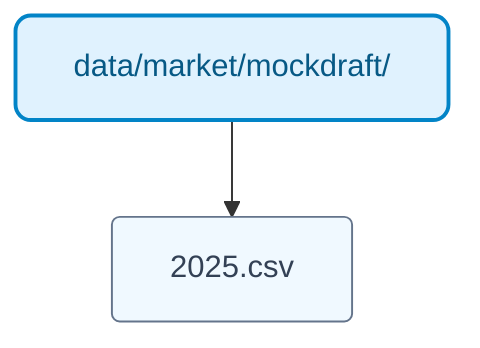

# Project Map — data/market/mockdraft

```mermaid
flowchart TB
  classDef folder fill:#e0f2fe,stroke:#0284c7,stroke-width:2,color:#075985,rx:8,ry:8
  classDef file fill:#f0f9ff,stroke:#64748b,stroke-width:1,color:#334155,rx:4,ry:4
  data_market_mockdraft["data/market/mockdraft/" ]
  class data_market_mockdraft folder
  data_market_mockdraft_2025_csv["2025.csv"]
  class data_market_mockdraft_2025_csv file
  data_market_mockdraft --> data_market_mockdraft_2025_csv
```
