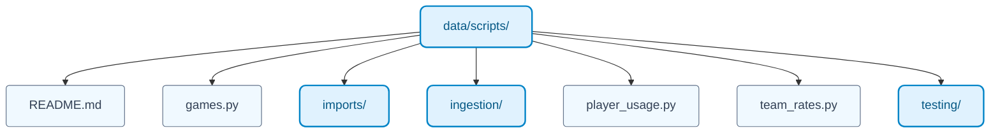

# Project Map — data/scripts

```mermaid
flowchart TB
  classDef folder fill:#e0f2fe,stroke:#0284c7,stroke-width:2,color:#075985,rx:8,ry:8
  classDef file fill:#f0f9ff,stroke:#64748b,stroke-width:1,color:#334155,rx:4,ry:4
  data_scripts["data/scripts/" ]
  class data_scripts folder
  data_scripts_README_md["README.md"]
  class data_scripts_README_md file
  data_scripts --> data_scripts_README_md
  data_scripts_games_py["games.py"]
  class data_scripts_games_py file
  data_scripts --> data_scripts_games_py
  data_scripts_imports["imports/"]
  class data_scripts_imports folder
  data_scripts --> data_scripts_imports
  click data_scripts_imports "/admin/project-map/data/scripts/imports" "Open imports"
  data_scripts_ingestion["ingestion/"]
  class data_scripts_ingestion folder
  data_scripts --> data_scripts_ingestion
  click data_scripts_ingestion "/admin/project-map/data/scripts/ingestion" "Open ingestion"
  data_scripts_player_usage_py["player_usage.py"]
  class data_scripts_player_usage_py file
  data_scripts --> data_scripts_player_usage_py
  data_scripts_team_rates_py["team_rates.py"]
  class data_scripts_team_rates_py file
  data_scripts --> data_scripts_team_rates_py
  data_scripts_testing["testing/"]
  class data_scripts_testing folder
  data_scripts --> data_scripts_testing
  click data_scripts_testing "/admin/project-map/data/scripts/testing" "Open testing"
```
