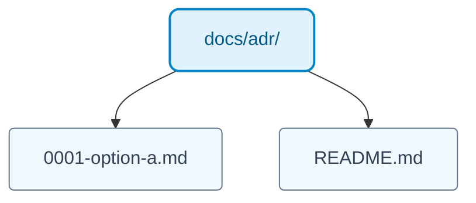

# Project Map — docs/adr

```mermaid
flowchart TB
  classDef folder fill:#e0f2fe,stroke:#0284c7,stroke-width:2,color:#075985,rx:8,ry:8
  classDef file fill:#f0f9ff,stroke:#64748b,stroke-width:1,color:#334155,rx:4,ry:4
  docs_adr["docs/adr/" ]
  class docs_adr folder
  docs_adr_0001_option_a_md["0001-option-a.md"]
  class docs_adr_0001_option_a_md file
  docs_adr --> docs_adr_0001_option_a_md
  docs_adr_README_md["README.md"]
  class docs_adr_README_md file
  docs_adr --> docs_adr_README_md
```
