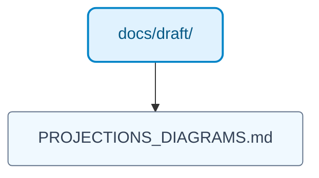

# Project Map — docs/draft

```mermaid
flowchart TB
  classDef folder fill:#e0f2fe,stroke:#0284c7,stroke-width:2,color:#075985,rx:8,ry:8
  classDef file fill:#f0f9ff,stroke:#64748b,stroke-width:1,color:#334155,rx:4,ry:4
  docs_draft["docs/draft/" ]
  class docs_draft folder
  docs_draft_PROJECTIONS_DIAGRAMS_md["PROJECTIONS_DIAGRAMS.md"]
  class docs_draft_PROJECTIONS_DIAGRAMS_md file
  docs_draft --> docs_draft_PROJECTIONS_DIAGRAMS_md
```
