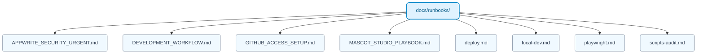

# Project Map — docs/runbooks

```mermaid
flowchart TB
  classDef folder fill:#e0f2fe,stroke:#0284c7,stroke-width:2,color:#075985,rx:8,ry:8
  classDef file fill:#f0f9ff,stroke:#64748b,stroke-width:1,color:#334155,rx:4,ry:4
  docs_runbooks["docs/runbooks/" ]
  class docs_runbooks folder
  docs_runbooks_APPWRITE_SECURITY_URGENT_md["APPWRITE_SECURITY_URGENT.md"]
  class docs_runbooks_APPWRITE_SECURITY_URGENT_md file
  docs_runbooks --> docs_runbooks_APPWRITE_SECURITY_URGENT_md
  docs_runbooks_DEVELOPMENT_WORKFLOW_md["DEVELOPMENT_WORKFLOW.md"]
  class docs_runbooks_DEVELOPMENT_WORKFLOW_md file
  docs_runbooks --> docs_runbooks_DEVELOPMENT_WORKFLOW_md
  docs_runbooks_GITHUB_ACCESS_SETUP_md["GITHUB_ACCESS_SETUP.md"]
  class docs_runbooks_GITHUB_ACCESS_SETUP_md file
  docs_runbooks --> docs_runbooks_GITHUB_ACCESS_SETUP_md
  docs_runbooks_MASCOT_STUDIO_PLAYBOOK_md["MASCOT_STUDIO_PLAYBOOK.md"]
  class docs_runbooks_MASCOT_STUDIO_PLAYBOOK_md file
  docs_runbooks --> docs_runbooks_MASCOT_STUDIO_PLAYBOOK_md
  docs_runbooks_deploy_md["deploy.md"]
  class docs_runbooks_deploy_md file
  docs_runbooks --> docs_runbooks_deploy_md
  docs_runbooks_local_dev_md["local-dev.md"]
  class docs_runbooks_local_dev_md file
  docs_runbooks --> docs_runbooks_local_dev_md
  docs_runbooks_playwright_md["playwright.md"]
  class docs_runbooks_playwright_md file
  docs_runbooks --> docs_runbooks_playwright_md
  docs_runbooks_scripts_audit_md["scripts-audit.md"]
  class docs_runbooks_scripts_audit_md file
  docs_runbooks --> docs_runbooks_scripts_audit_md
```
